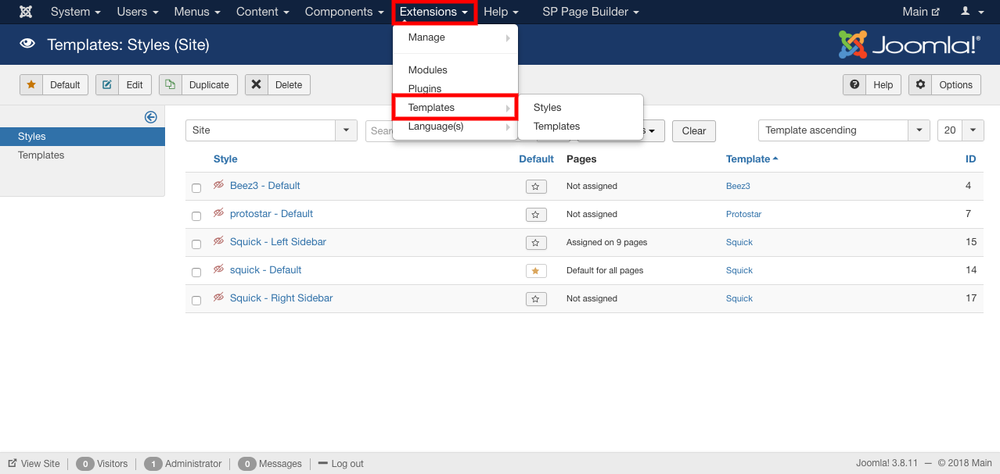

Template is the backbone for creating the webpages for your shop.You can download or buy different types of  templates from https://www.sellacious.com/sellacious-templates. Templates are pre-formatted in some way.

To Manage Templates :
1. Go to the joomla admin(http://www.domain.com/admin).
2. Go to the extensions->Templates.

3. You can manage the templates from here.
a) You can edit your template by clicking on the template.
b) You can delete your template by clicking on the template.
4. After changing the tenplate details click on the save button to save the details.