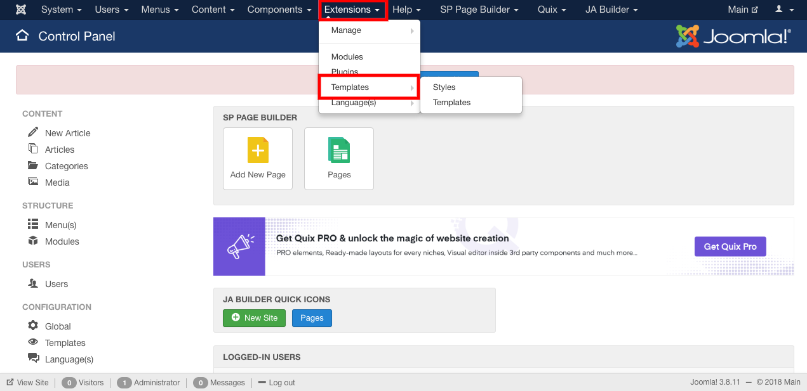
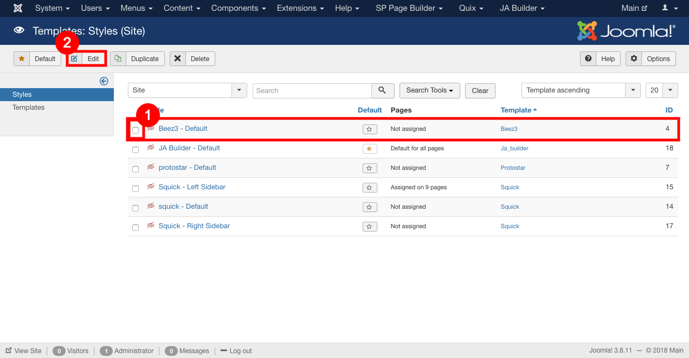

##### **To Edit a template, follow steps:**

* Go to the joomla admin.
* Go to the extensions->templates.

* Select the template and click on the edit button or Click on the template you want to edit .

* Click on the save button to save the changes.

##### **To Delete a template, follow steps:**

* Go to the joomla admin.
* Go to extensions-> Templates.

* select the template and click on the delete button.

* Selected template is deleted.
 
##### **To Add a template, follow steps:**

* To add a new template, install it.
* Get more details from the below link:
  https://sellacious.com/learn/template/installing-template

