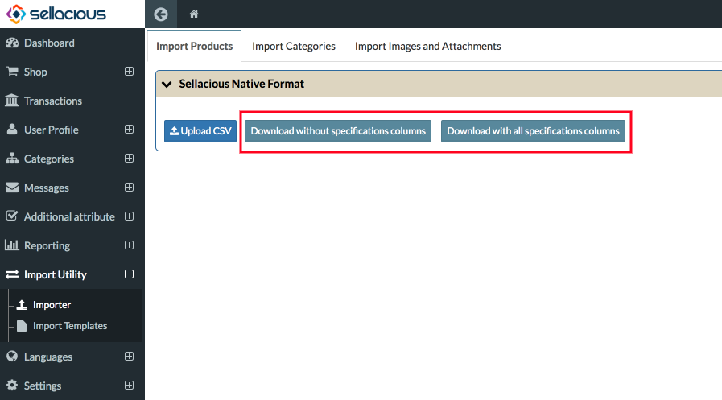
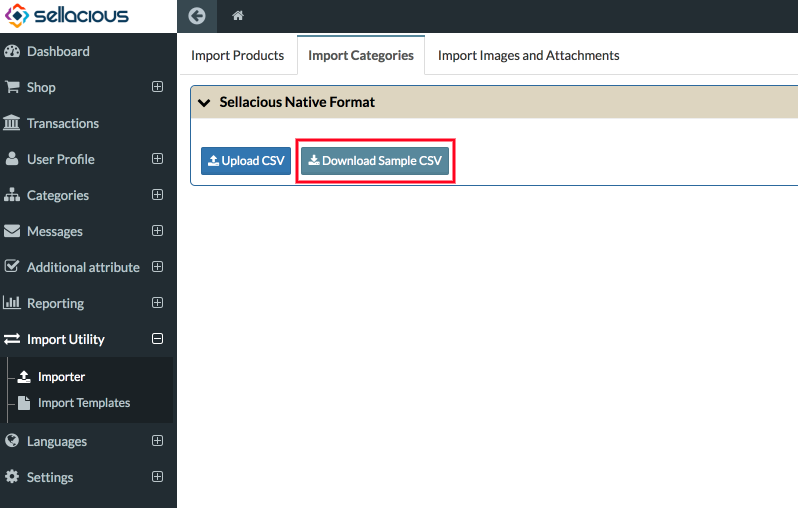
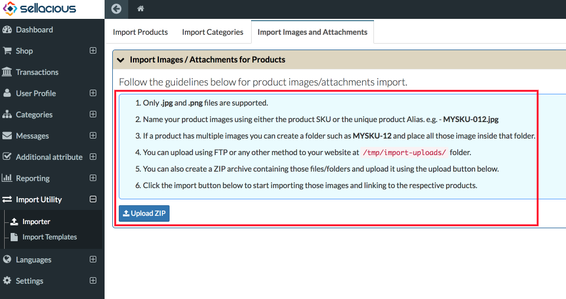

**Import** : Import is to use data produced by another application. The ability to import data is very important in software applications. In sellacious You can import data through menu- "Import Utility" present in the left menubar. You can import data throgh csv, like product type, its features, price, stock, quantity. You can also create sellers, variants and categories of that product with the same CSV.

**Import Products** : You can import large number of products easily with sellacious importer. Fill all the details you want to import in your products and import the CSV. Product importer is your best option as while importing the products, you can also import new categories, sellers, manufacturers, special categories along with the products and their variants. To know the format of sellacious importer you can always download the Sample CSV. You can download it with or without specifications columns.

**Import Categories** : You can always import categories in bulk with the help of Sellacious Importer. You can always download the sample CSV from the import categories Tab. You can import categories in hierarchy.E.g: Parent Category/Child category1. 

**Import Images and Attachments for Products** : You can always import Images and Attachments for Produts though importer. You need to upload the ZIP file of the images named according to products SKU/alias or title.

 