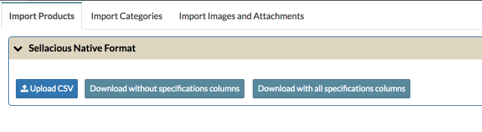
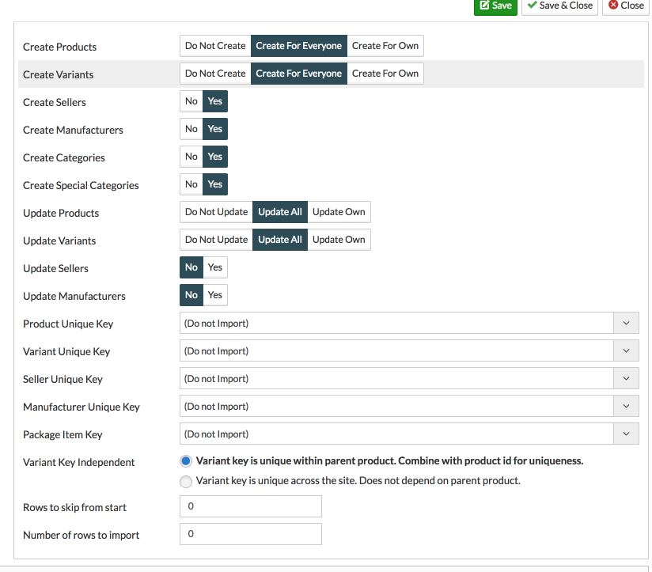

**Import products** is a easy process to import products, their variants, sellers, categories to sellacious.

To start the importer process you can download the sellacious default product importer sample CSV or you can create a importer template. [How to create a importer Template?](https://www.sellacious.com/learn/import-and-export/import-templates)

In this Documentation we will use sellacious default import CSV.

To import products in your site follow below steps.

1. Download the sampple CSV you want to import from. You can download the Default sellacious importer template or any of your customised template.
2. Fill the Basic details of the products. Product importer has 4 Unique keys for products, **PRODUCT_TITLE, PRODUCT_UNIQUE_ALIAS, PRODUCT_SKU, MFG_ASSIGNED_SKU** You can fill all these 4 unique keys or one. One of them is must to import the products.
3. Products inventory fields like Stock, listing dates, Max & min qty., Price of products varies according to the seller, hence, fill them according to the sellers.
4. To import the sellers, fill the details of seller. If the seller is already existed in your site, you can just fill the name, email, username, code or business name. To import sellers unique keys are **SELLER_NAME, SELLER_USERNAME, SELLER_EMAIL, SELLER_CODE, SELLER_BUSINESS** One of these is must to import the sellers.
_If seller is new, you need to fill all the columns related to sellers available in CSV._ [How to import sellers form CSV?](https://www.sellacious.com/learn/import-and-export/import-seller)
 You can also import products with multiple sellers. If there are multiple sellers to the one product, one row will be for the one seller. And in the 2nd row you can fill the details of another seller. In that second  row fill the details of that products too. You can change the stock, listing dates, Price etc. according to the seller.
5. To publish the product in frontend mandatory columns to import are PRODUCT_TYPE, PRODUCT_CURRENT_STOCK, PRODUCT_STATE, Seller related columns, PRODUCT_CATEGORIES.
6. To import variants, with any of product unique key, fill the variants related columns in separate row. You can import multiple variants of same products but with different sellers too with sellacious importer.
 There are 3 Unique keys to import varinats : **VARIANT_TITLE, VARIANT_SKU, VARIANT_UNIQUE_ALIAS.** One of these key is must to import variants. [How to import varinats from CSV?](https://www.sellacious.com/learn/import-and-export/import-variants)
7. While you're importing products, you can import these products to new or existing categories. To create the child categories format should be : **Prent Category/Child Category.** If there are more than one type category assigned to the product, than first category should be in the **PRODUCT_CATEGORIES** and other one in the columns **CATEGORY_1**.
8. In sellacious prices are of 3 types. Flat, basic and Dynamin (Advanced). 

While you're importing products through CSV there are some configuration you need to save to complete the importing process. If you want to create new products/sellers etc you need to select respective 'create' options 'yes'. If you only want to update the exisiting products/sellers/categories you need to select the options for the Update as 'yes'.

After this it's mandatory to select the unique keys to validate the import. The section in which you didn't select the unique key will not be imported.

**This is the sample CSV to understand the importing process of sellacious importer.**