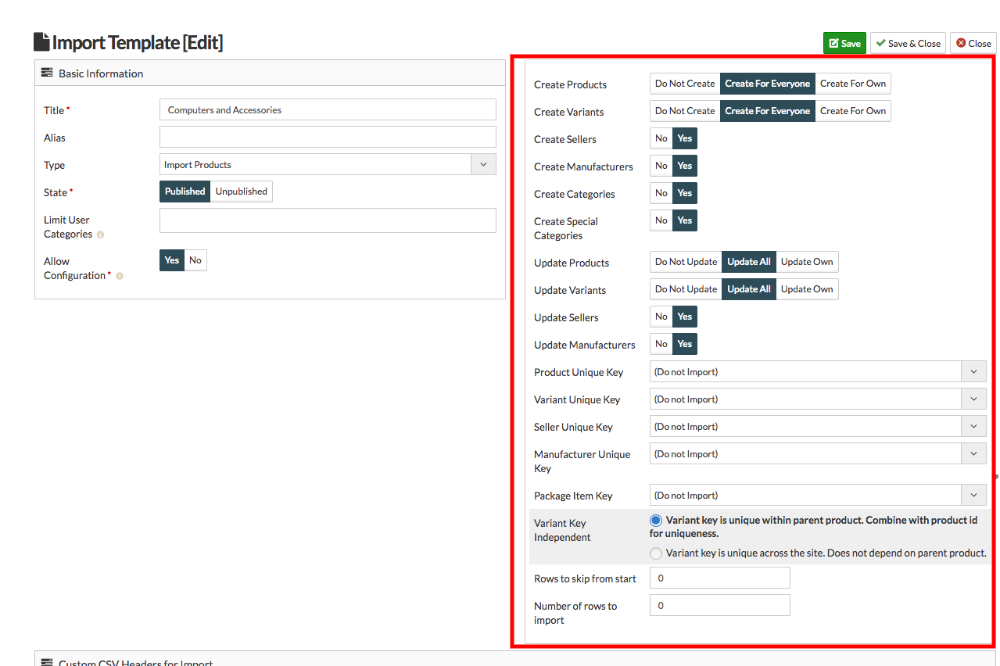
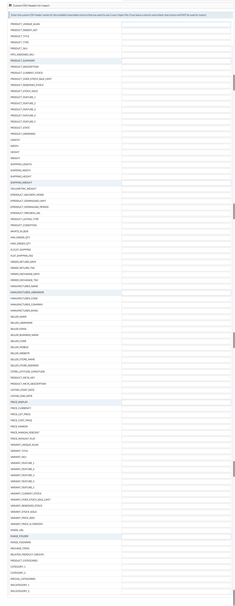

**Import Template** is a template where you can fix the columns you need to import.
* Through creating new template you can modify the Default CSV.
* Whenever you import a template you have to go through some settings.but If you are creating a new template you can   make that settings once and dont have to go thrugh it everytime.

**To create a new Import Template, follow steps:**

1. Go to **Import Utility** from the left menubar.
2. select import templates from the drop down menu.
3. To create a new template click on new button.

4. Fill the details in basic information.
5. Type the title for the template and select the type whether the template is to import product, import category or    to import images and other attachments.
6. On the right there will some settings, make that settings and you dont have to go through these settings again      when you import this template.

7. At the bottom there are Default Custom CSV headers available in CSV.

8. write the column names in front of the present columns, you want to take in your template.
9. If you dont want a column in your template then leave it blank.
10. Click on save button.
11. And your template is created.