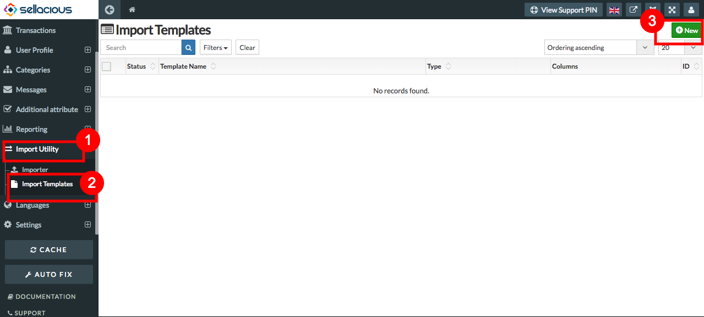

**Importer Templates** are template where you can customise the columns you want to import. There can be more than one import template for more products, categories and images.
* You can modify the template according to your CSV or you can create a template with your desired fields and configuration first and than download the sample CSV of the template.
* 
**To create a new Importer Template, follow steps:**

1. Go to **Import Utility** from the left menubar.
2. Select import templates from the drop down menu.
3. To create a new template click on new button.

4. Fill the details in basic information.
5. Type the title for the template.
6. You can always select user categories to which you want to assign this template.
7. Select the type whether the template is to import product, import category or to import images and attachments of products. Once you select the type, on the right of the template you'll be able to the configuration of the selected importer type.
8. If you want to use the same configuration settings for every import, you need to select "Allow Configuration" as Yes, If not Select NO.

7. At the bottom there are Default Custom CSV headers available in CSV.

8. write the column names in front of the present columns, you want to take in your template.
9. If you dont want a column in your template then leave it blank.
10. Click on save button.
11. And your template is created.