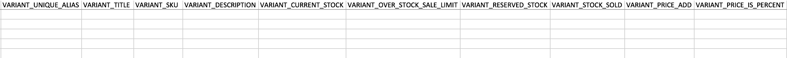

You can always import variants for the new products along with the already created products. Download the sample CSV from the Import Utilities > Import. After that fill all the details for the product import.

To import the variants, you need to fill the details of variants in the different row with the Unique keys of Products and Sellers. Unique keys for variants are **VARIANT_TITLE, VARIANT_SKU, VARIANT_UNIQUE_ALIAS**. One of these is must to import the variants.

If you're creating the new variants in configuration select option Create New Variant as YES. If you're only updating the variants, than select the update variant option as YES.