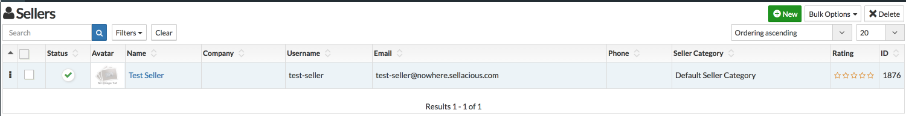

With the help of sellacious importer you can create or update the exiscting sellers. To import sellers in your site, fill the products details in CSV and then fill the columns related to the sellers. SELLER_NAME, SELLER_USERNAME, SELLER_EMAIL are 3 important columns to import sellers.

**SELLER_NAME, SELLER_USERNAME, SELLER_EMAIL, SELLER_CODE, SELLER_BUSINESS** are the Unique keys to import sellers. One of these key is must to import sellers. You need to fill the products details or any Product unique key.

If the seller is new and you have not provided the Unique for sellers, then sellacious will create them itself. Like if you're importing a new seller with the name Test Seller. Than sellacious will create it's username and email itself in the below format.

As you can see the username is _test-seller_ and email is _test-seller@nowhere.sellacious.com_ 