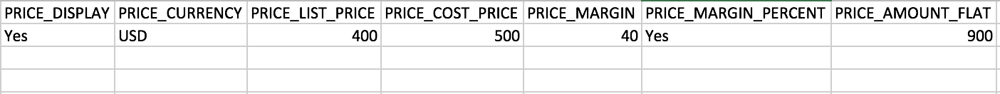
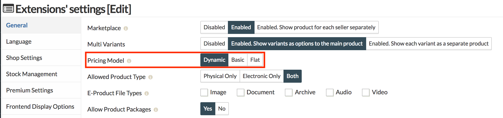
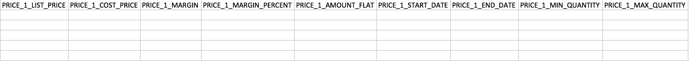

Sellacious has 3 types of Pricing. Flat, Basic and Dynamic. By default sellacious configure Basic pricing. When you download the sample CSV, you'll get the columns for basic and flat price only.

To download the sample CSV with Dynamic Pricing, you need to enable this pricing from the Global Configuration of sellacious administrator.

If a product is of different sellers than pricing can be different for different seller. That way Product Unique will be same for sellers and for every seller fill the pricing details. You can import dynamic pricing through columns or rows. One row will have the values of one dynamic pricing for one seller. You can import multiple dynamic pricing values for one seller, with the values of pricing along with the Unique key of Product and seller.

