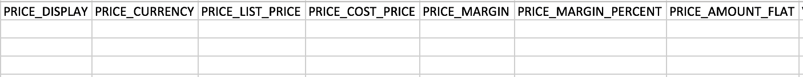

Sellacious has 3 types of Pricing. Flat, Basic and Dynamic. By default sellacious configure Basic pricing. When you download the sample CSV, you'll get the columns for basic and flat price only.

To download the sample CSV with Dynamic Pricing, you need to enable this pricing from the Global Configuration of sellacious administrator.

