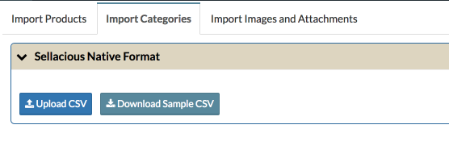
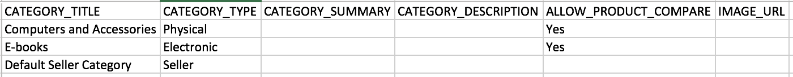
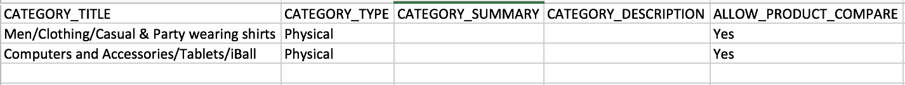
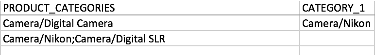

Sellacious importer is a easiest way to import categories for your shop. Either you can create categories while importing products or you can import the categories directly from the Sellacious Backend > Import Utilities > Import. From import categories tab, you can import categories. You can always downlaod the sample for the categories.

You can import physical, electronic or user categoeries like Seller/Client.

You can always import categories in hierarchy. Format to import categories in hierarchy is :

You can use the above format to import categories while importing products also. And if the product belongs to more than one category you can **;** or fill the both categories in the columns **PRODUCT_CATEGORIES, CATEGORY_1** etc.

