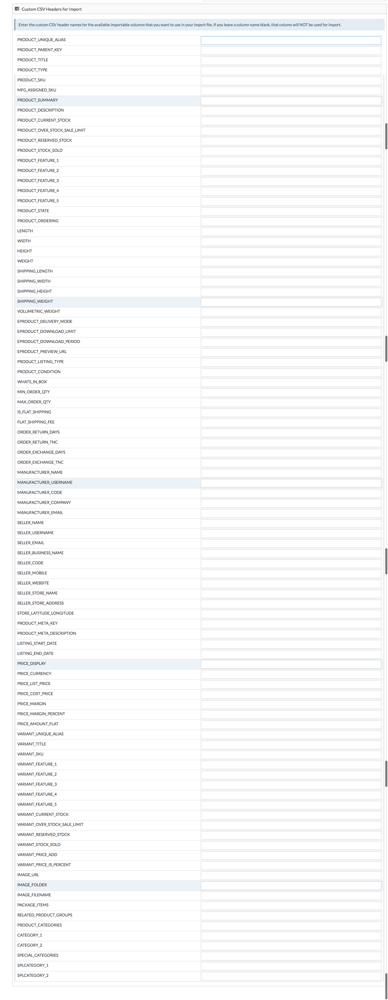

**Import Template** is a template where you can fill information of the products, create products, update products and can import in sellacious. Creation or updation of products in the template can be imported in sellacious and all the changes made in the template will import in sellacious.
* You can create a new template according your needs, you can select columns you need, change the column names.
* Whenever you import a template you have to go through some settings and you have to change the settings everytime. * But when you create a new template you can make that changes there, and whenever you import that template you dont   have to change the settings.

**To create a new Import Template, follow steps:**

1. Go to **Import Utility** from the left menubar.
2. select import templates from the drop down menu.
3. To create a new template click on new button.

5. Fill the details in basic information.
6. On the right there will some settings, make that settings and you dont have to go through these settings again      when you import this template.

6. At the bottom there are Custom CSV headers For import.

7. write the column names in front of the present columns, you want to take in your template.
8. If you dont want a column in your template then leave it blank.
9. Click on save button.
10. And your template is created.