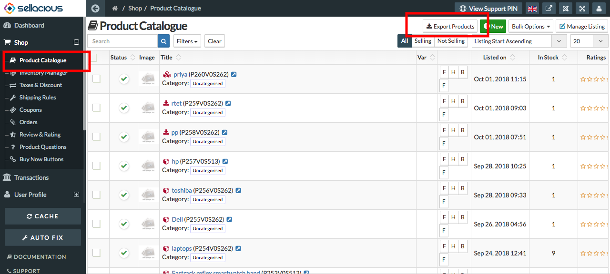

**Import** : Import is to use data produced by another application. The ability to import data is very important in              software applications. In sellacious You can import data through menu-"Import Utility" present in the                left menubar.

**Export** : 
          * In sellacious we can export products.
          * when we export products, all products with their categories will import.
          * We can't export categories otherwise.
          * If we export products, the file will downloaded in the system.
          * And we can import that downloaded file in other sites.
          * To export products- Go to shop, select product catalogue from the drop down menu and select Export                   Product option from the top. 

 