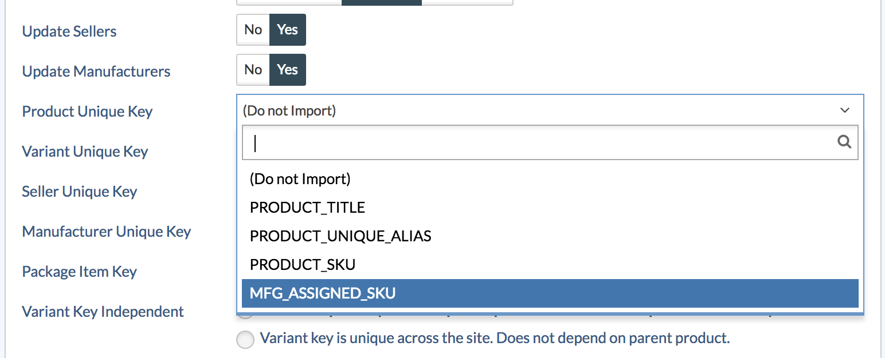
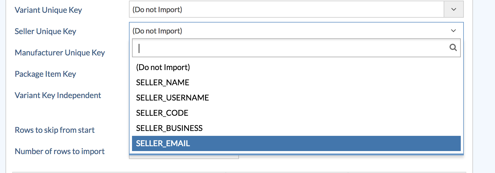

**Uses Of Import Templates:**
* In sellacious We use import templates to create products, sellers, categories, variants etc.
* we can also use these templates to update products.
* Through these templates, we make the import settings once without going through them again and again..

**To import the template in sellacious, follow steps:**

1. Go to Import Utility from the left menubar.
2. select importer from the drop down menu.
3. select import product and all your created import template will be shown.

4. select the import template from them.
5. On selected import template click on Download Sample CSV.

6. Open the downloaded file.
7. Fill the columns in the open templates.

8. Download the sample template in CSV format.
9. To import the sample template in sellacious, first navigate to import utility on the left side of panel.
10. Then click on importer option from  the dropped down menu.
11. In the Sellacious native format, select upload csv and upload the downloaded csv file.

12. Select options which you want to import in Import configuration. Like if you want to create products/varinats/categories/sellers select create options as Yes and if you want to update the already created products/varinats/categories/sellers select update options as Yes.
13. After above settings, don't forget to select the unique keys. Unique key should be different for every product/seller/manufacturers/variants. Unique can be SKU, alias, name of the products.

14. As for seller and manufacturer it can be name, username, email etc.

15. Start the import.
16. Once import is finished, Click refresh Cache from left sidebar.
17. And your changes will be updated.