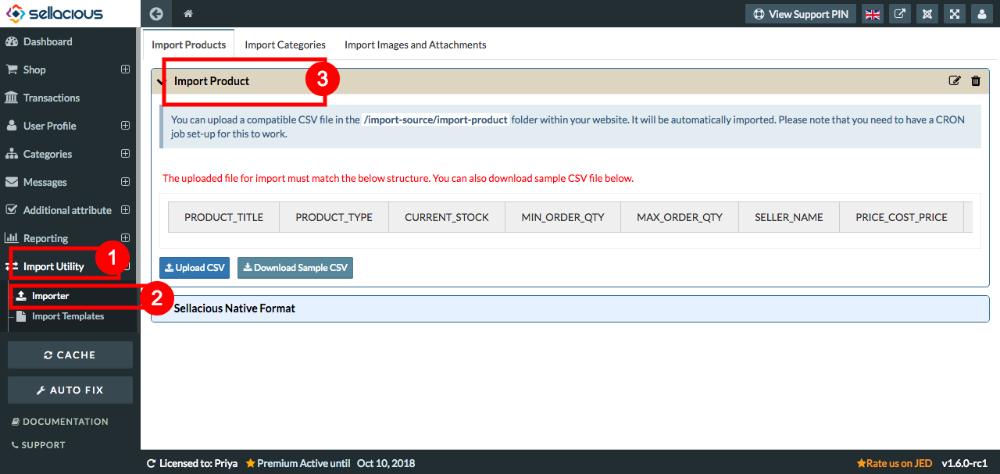
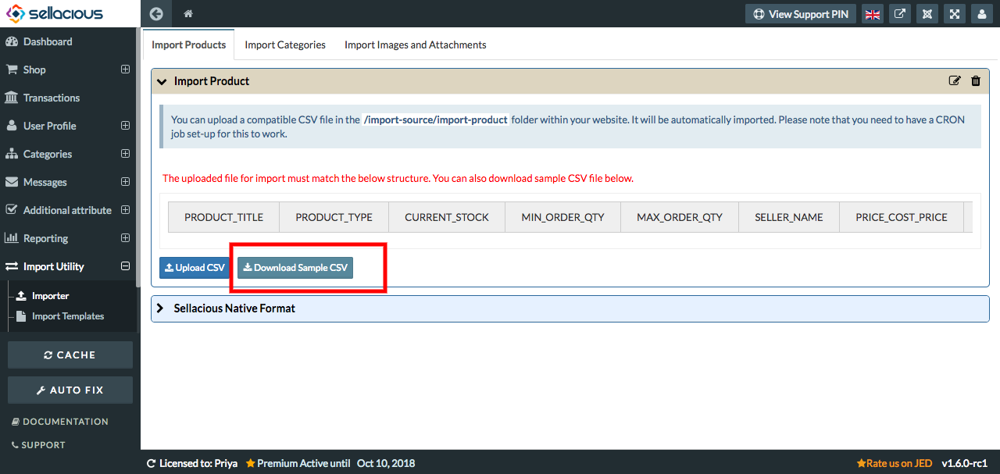
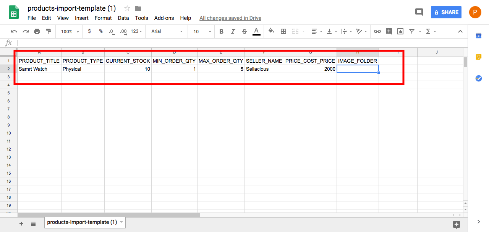
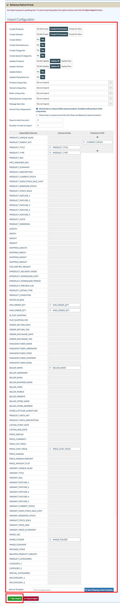

**Uses Of Import Templates:**
In sellacious We can create new import templates to import products, categories, images, product details etc.
In created import template we can create product, categories and import them in sellacious.
All changes made in the template can import in the sellacious through importer.

**To import the template in sellacious, follow steps:**

1. Go to Import Utility from the left menubar.
2. select importer from the drop down menu.
3. select import product and all your created import template will be shown.

4. select the import template from them.
5. On selected import template click on Download Sample CSV.

6. Open the downloaded file.
7. Fill the columns in the open templates.

8. Download the sample template in CSV format.
9. To import the sample template in sellacious, first navigate to import utility on the left side of panel.
10. Then click on importer option from  the dropped down menu.
11. In the Sellacious native format, select upload csv and upload the downloaded csv file.

12. Select options which you want to import in Import configuration.
13. Start the import.
14. Click refresh Cache from left sidebar.
14. And your changes will be updated.