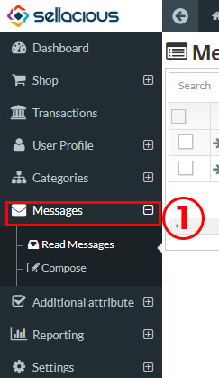
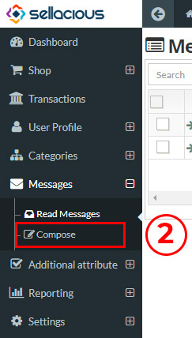
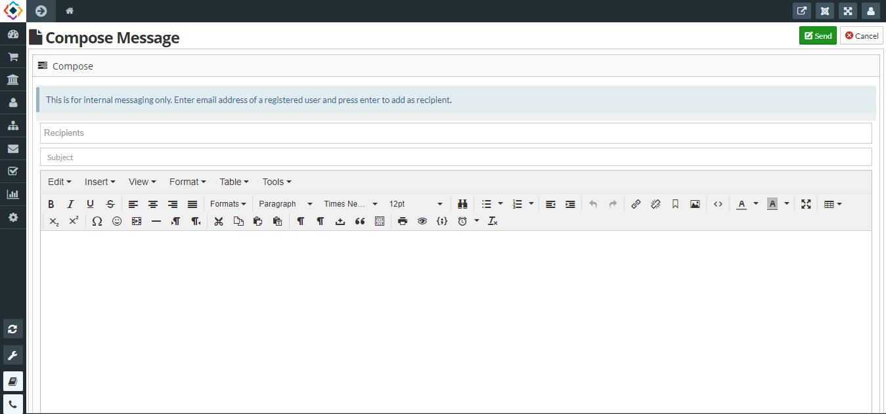
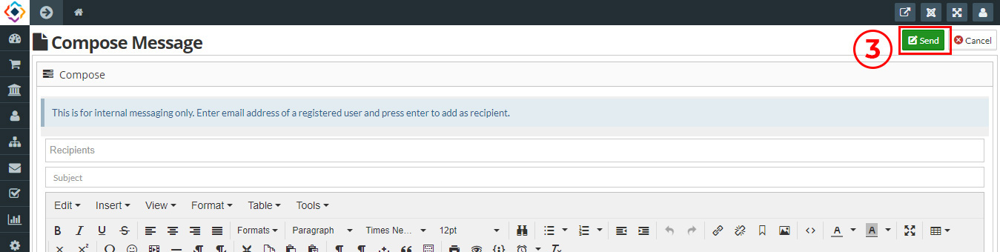

**COMPOSING A MESSAGE**
1. Go to the sellacious panel of your website.
2. For composing message, go to messages and select compose message from the dropped down menu.\

3. There are two shortcuts for navigating to compose the messages:
a) From the compose menu in sellacious backsite.

b) From the read messages menu in the sellacious backsite.

4. Fill the information about the messages for recipients, subjects and the content.
When you click on the recepients all the categories are to be appeared. The categories include the staff,client,seller and manufacturer.

5. click on send button to compose the message details, the message is successfully sent.
