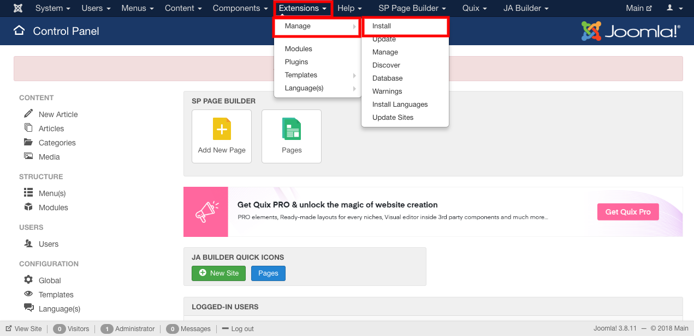
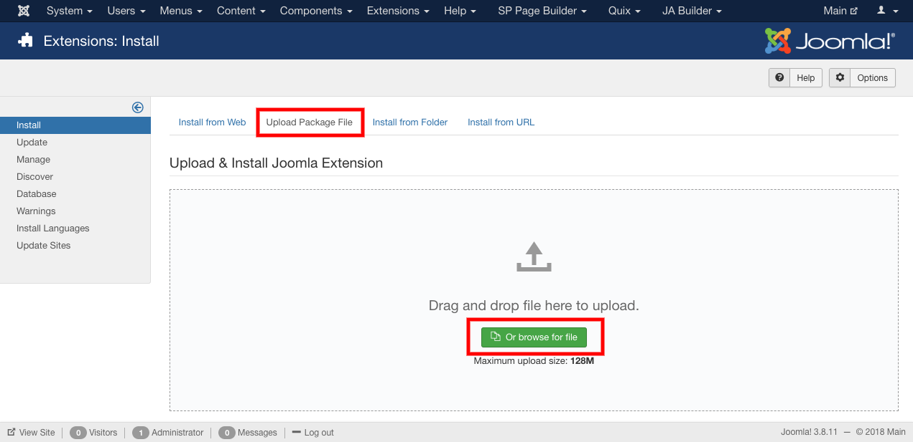
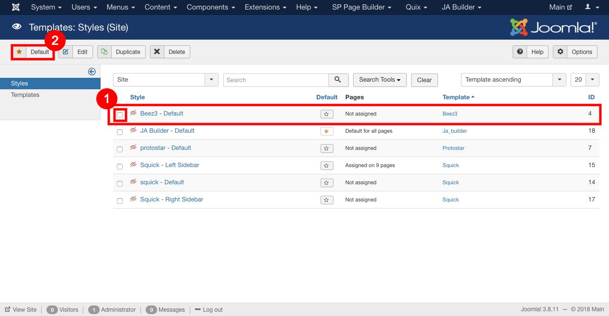
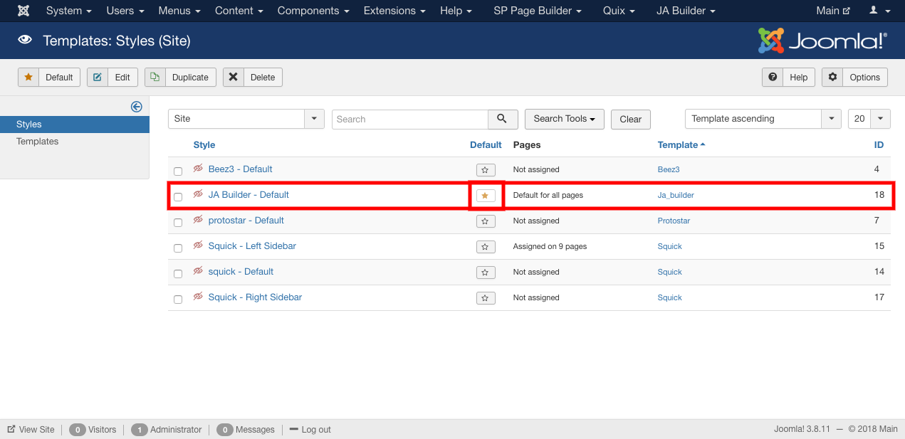

##### **To Install Template, Follow steps:**

1. After downloading the Template go to the Joomla administration panel of your website.
2. Go to Extensions -> click on Manage from the drop down menu.
3. Select install option.

4. Upload the file in Upload Package File section.

5. Your template is installed.
6. If you want to use the template, Follow steps:
7. Go to the extensions and select template from the drop down menu.

8. For working with the particular template, set the template as default.
9. There are two ways to change the template:
    * Select the template then click on the default button.

    
    
    * Click on the star icon to create the template as default.

    