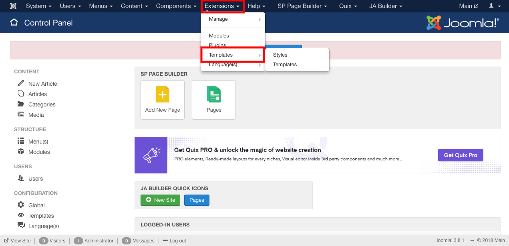

##### **To edit the address and contact, Follow Steps:**

1. Go to the joomla administrator panel of your website.
2. Go to the extensions, select templates from the drop down menu.

3. The default templates can be identified from the yellow star in the Default column.
4. Select the default template and click edit button.
5. In Basic tab, Edit the information in the contact information.

6. Click on the save button to save the changes.

