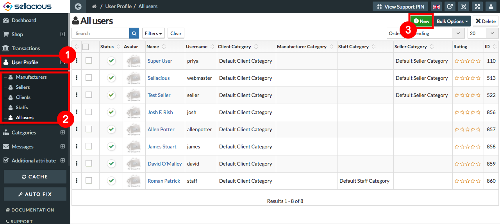
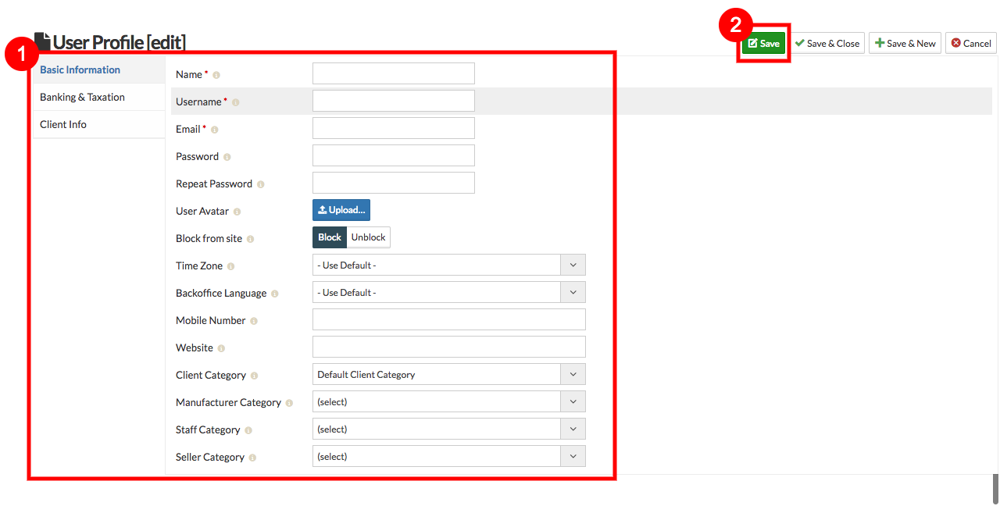

* A **User Profile** is a collection of settings and information associated with a user.
* User profile is a section where you can create a new user in sellacious. 
* The users include  all users, manufacturers, sellers, clients and staffs.

**TO A CREATE A NEW USER PROFILE, FOLLOW STEPS:**

1. Go to sellacious admin panel.
2. Go to User Profile menu from the left menu bar.
3. Select the user profile from the drop down menu.
4. click on new button to create a new profile.

5. fill the credentials.
6. save the settings.

7. New User Profile is created.

