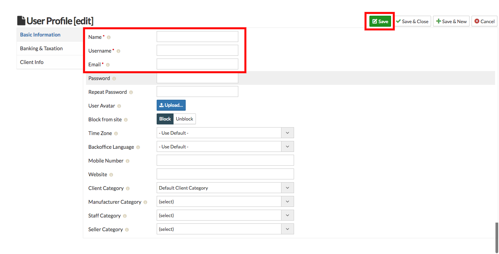

**Manufacturer is a person or company that makes goods for sale.** 
**Therefore that person can make its profile and assign its name to the products.**

##### **To Create Manyfacturer Profile, Follow steps:**

1. Go to the sellacious admin panel of your website.
2. Go to User profile and select Manufacturer from the dropped down menu.
3. To create a new manufacturer profile, click on new button.

4. Fill the Credentials in the given fields.
5. In Basic Information tab **Name**, **Username**, **Email** Fields are mandatory.
6. Click on save button to save the manufacturer details.

7. Created Manufacturer Profile is successfully added.
