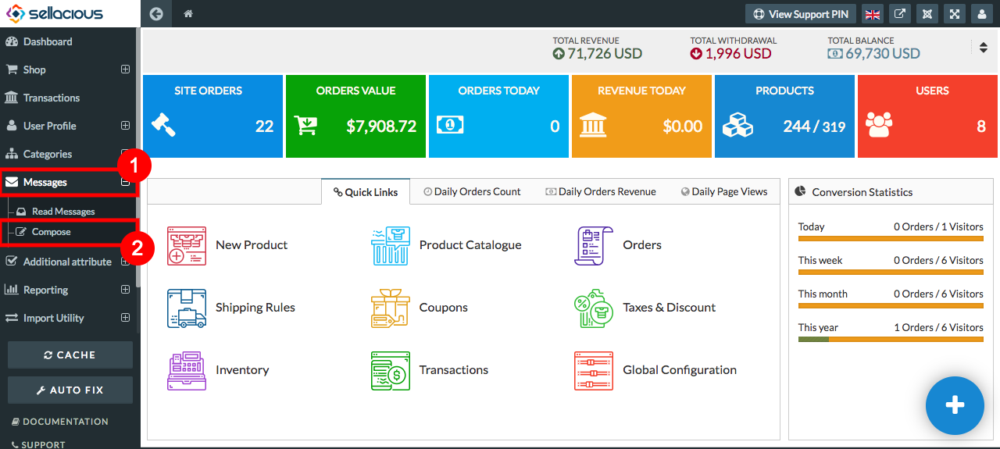
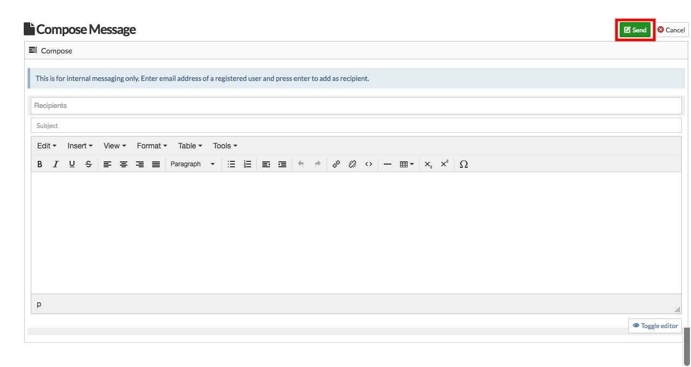

Compose message feature helps in creating a new message.You can use this for internal messaging only. Enter email address of a registered user and press enter to add as recipient.

##### **To Compose a message, Follow steps:**

1. Go to the sellacious admin panel.
2. Go to messages and select compose message from the dropped down menu.

3. Fill the credentials in recipients, subjects and the content Fields.
4. Click on send button to send the message.

5. And the message is successfully sent.

* **Recipients**: Enter the email id of the person you want to sent the message. It can be from the client categories,seller categories and manufacturer categories.
*  **subject**: The subject defines the heading of the message and defines a short description of the message.
*  **Message Body**: Message body contains the actual message content, sending to the recipient.There are many tools available for the user to modify the message body.
*  **Toggle Editor**: The toggle editor is a section to edit your description layout by using coding. This editor will helps you to code in HTML and CSS language.
*  **Send**: Send button will send the message to the recipient. 
*  **Cancel**: Close button will close the message page.
* 