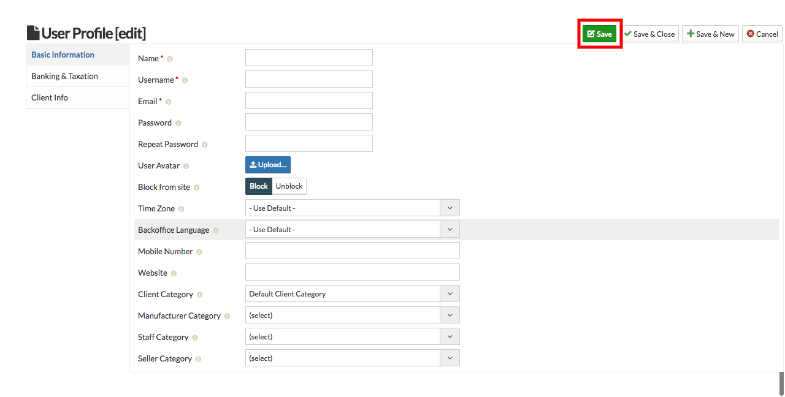

##### **To Create a new Seller Profile, Follow Steps:**

1. Go to the sellacious admin panel of your website.
2. Go to User profile and select Seller from the dropped down menu.
3. To create a new Seller profile, click on new button.

4. Fill the credentials.
5. In Basic Information section- name, Username, email fields are mandatory.
6. Click on save button to save the sellers details.

7. New seller is successfully added.

##### **To Manage Seller, Follow Steps:**

1. Go to sellacious admin panel.
2. Go to User Profile, select clients from the drop down menu.
3. Select the client, whose profile you want to edit or manage.

4. Edit the credentials.
5. As name, username and email fields are mandatory.
6. save the client.

7. Client details will be edited

