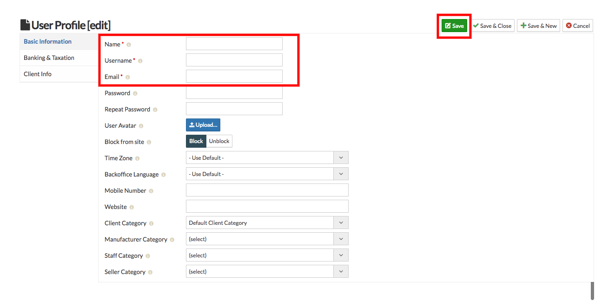
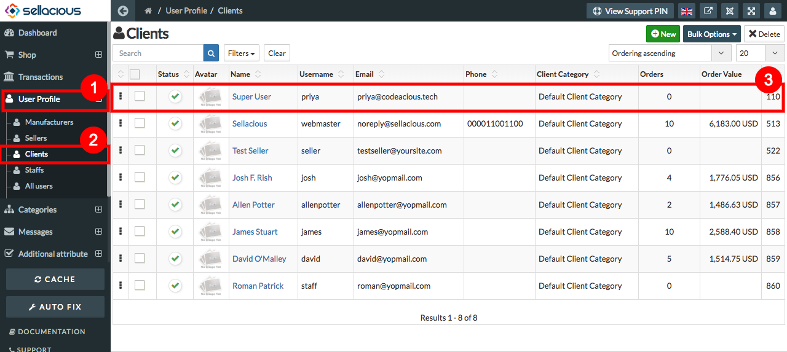
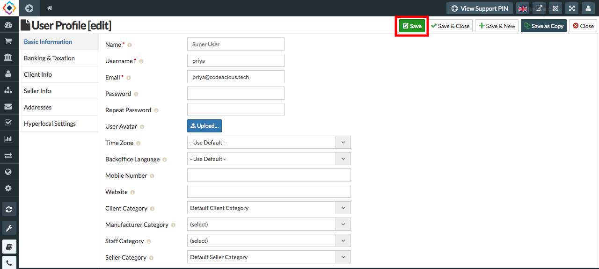

##### **To Create a new Client Profile, Follow Steps:**

1. Go to sellacious admin panel.
2. Go to User Profile, select Clients from the drop down menu.
3. Click on new button to create a new Client Profile.

4. Fill the credentials.
5. In Basic Information section- name, Username and email Fields are mandatory.
6. Click the save button.

7. New Client Profile is created.

##### **To Manage a Client Profile, Follow Steps:**

1. Go to sellacious admin panel.
2. Go to User Profile, select clients from the drop down menu.
3. Select the client, whose profile you want to edit or manage.

4. Edit the credentials.
5. As name, username and email fields are mandatory.
6. save the client.

8. Client details will be edited.

