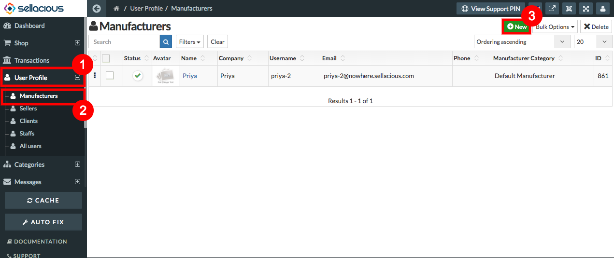
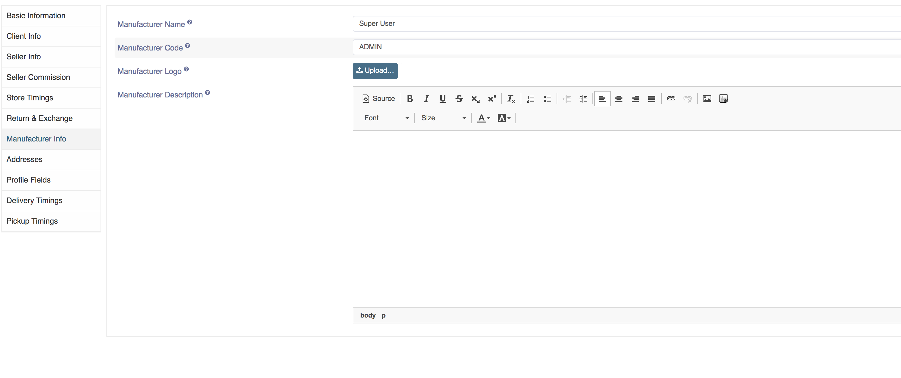
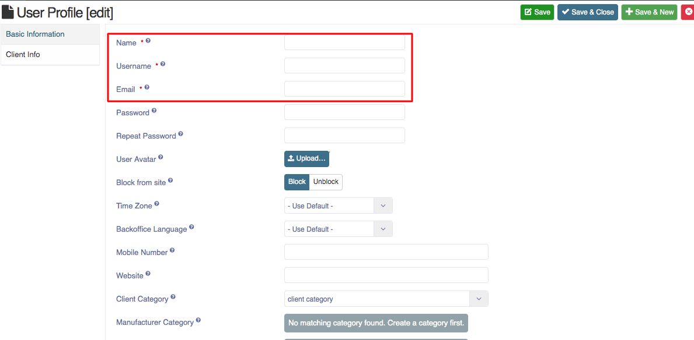

**Manufacturer is a person or company that makes goods for sale.** 
**Therefore that person can make its profile and assign its name to the products.**

##### **To Create Manufacturer Profile, Follow steps:**

1. Go to the sellacious admin panel of your website.
2. Go to User profile and select Manufacturer from the dropped down menu.
3. To create a new manufacturer profile, click on new button.

4. Fill the Credentials in the given fields.
5. In Basic Information tab **Name**, **Username**, **Email** Fields are mandatory.
6. You can add manufacturer description also in manufacturer description field

7. Click on save button to save the manufacturer details.

8. Created Manufacturer Profile is successfully added.
9. By default client category is assigned to manufacturer.
10. Created manufacturer profile will be visible in Manufacturer Profile, If any manufacturer category is assigned to it.