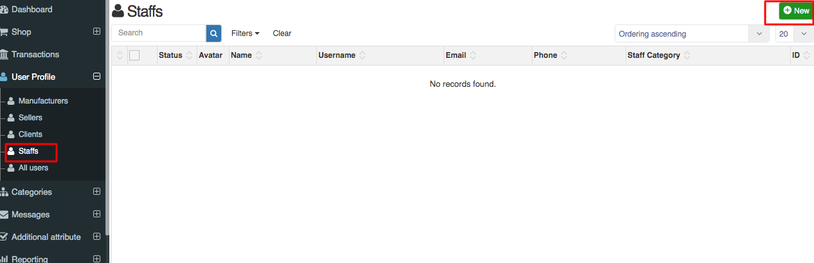

1. Go to the sellacious panel of your website.
2. For adding Staffs to your inventory, go to User profile and select staffs from the dropped down menu.

3. To create a new Staffs  profile, click on new button.
4. Fill the information about the Name, username and Email id of the Staffs.
5. Click on save button to save the Staffs details, the Staffs is successfully added.
