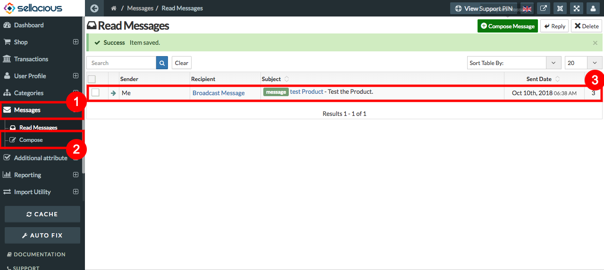
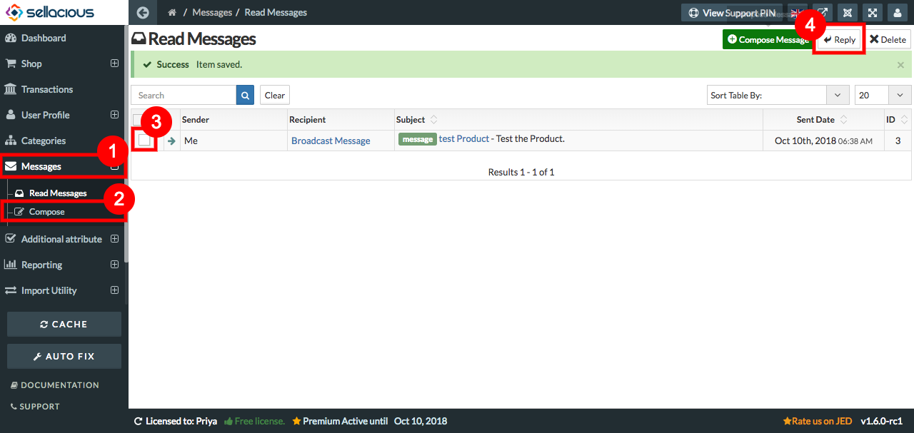
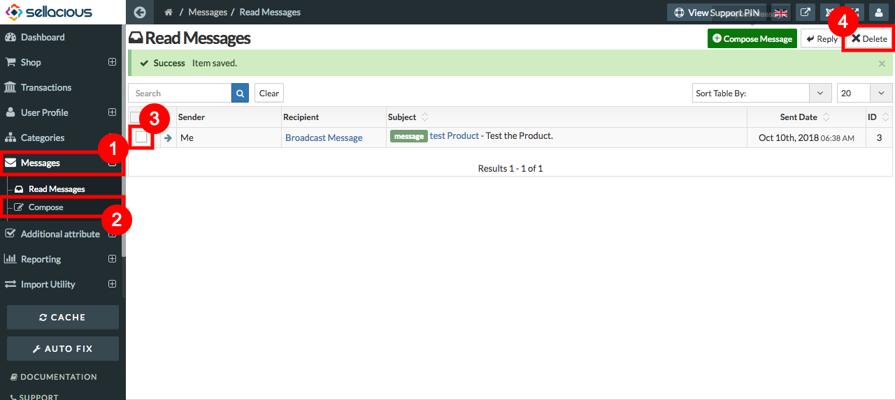

##### **To Read the message, Follow Steps:**

1. Go to the sellacious admin panel.
2. Go to Messages, select Read messages from the dropped down menu.
3. All the messages will be listed here, select the message you want to read.

4. And the message will open and you can read it.

##### **To Reply the message, Follow Steps:**

1. Go to the sellacious admin panel.
2. Go to message and select Read message from the dropped down menu.
3. To reply the message, Select the message you want to reply.
4. click on the reply button placed on the top.

5. And you can reply to the message.

##### **To Delete the message, Follow Steps:**

1. Go to sellacious admin panel.
2. Go to message and select Read message from the dropped down menu.
3. To delete the message, Select the message you want to delete.
4. Click on the delete button placed at the top.

5. And the selected message will delete.