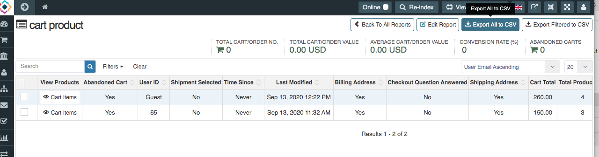
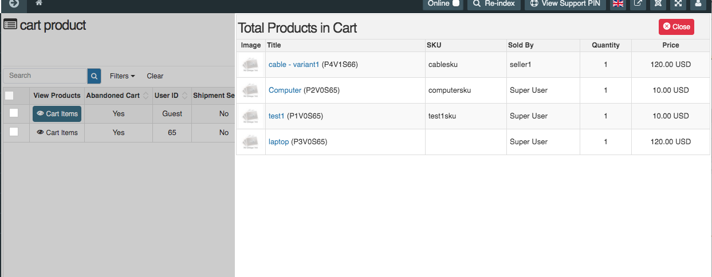

In advanced report you can also check Abandoned Cart Report. Abandoned cart tracking allows you to measure how many visitors/customers leave the checkout without completing a purchase, leaving items in the cart.
In advanced report, along with total products you can also check **cart items** in abanodeoned cart in a drawer to include the "View Products" column. 

To view all products in cart, open the cart report and click on **Cart Items**.

Drwaer will be open after click on cart items, in which you can check all products in abandoned cart. In Drwaer you can see product related columns like product image, title, sku, sold by, qunatity of product in cart, price.

