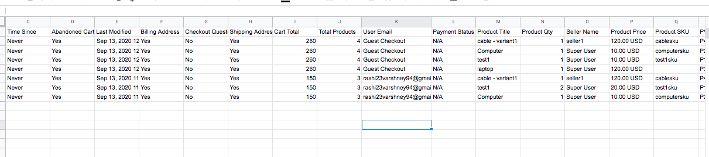

**Written by**: Rashi Gupta
**Date**: 27-10-2020
**Compatibility**: Sellacious v2.0.0-Beta1+

In advanced report you can also check Abandoned Cart Report. Abandoned cart tracking allows you to measure how many visitors/customers leave the checkout without completing a purchase, leaving items in the cart.For only abandoned cart, make sure to enable the config in report **Only Abandoned Carts**.
In advanced report, along with total products you can also check **cart items** in abanodeoned cart in a drawer to include the "View Products" column. 

To view all products in cart, open the cart report and click on **Cart Items**.

Drwaer will be open after click on cart items, in which you can check all products in abandoned cart. In Drwaer you can see product related columns like product image, title, sku, sold by, qunatity of product in cart, price.

We can also export these drwaer columns(cart items) except product image in csv. For this, you need to click on the button **Export All to CSV**. Csv file is look like the below image:

