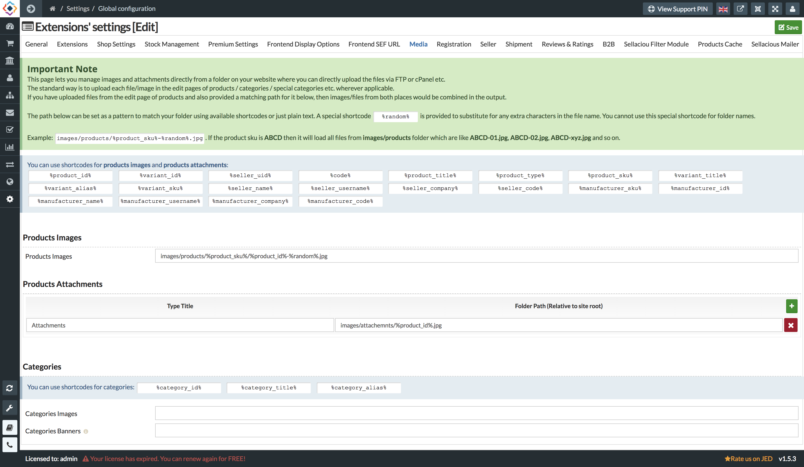

**Media:** 
This Page lets you manage images and attachments directly from a folder on your website, where you can directly upload the files via FTP or cPanel etc.
The standard way to upload the images in the product is to save each file/image in the edit pages of products, categories, special categories, etc wherever applicable.
If you have uploaded files from the edit page of products and also provided a matching path for it below, then images/files from both places would be combined in the output.

The path below can be set as a pattern to match your folder using available shortcodes or just plain text. Example: Images/product/%product_sku-%randon.jpg. If the product SKU is ABCD then it will load all files from images/products folder which are like ABCD-01.jpg, ABCD-02.jpg, ABCD-xyz.jpg and so on.

**Products**
Products Images: To manage the images from folder on your website. You can enter the folder path to access the product images.

**Product Attachments**
Products Attachements: To manage the attachments from folder on your website. You can enter the folder path to access the product attachments.

**Categories**
Categories Image: To manage the category images from folder of your website.You can enter the folder path to access the categories images.
Categories Banners: To manage the categories banners from folder of your website. You can enter the folder path to access the caetgory banners.
