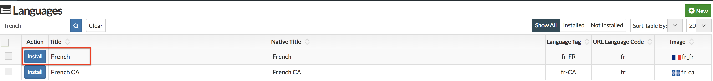
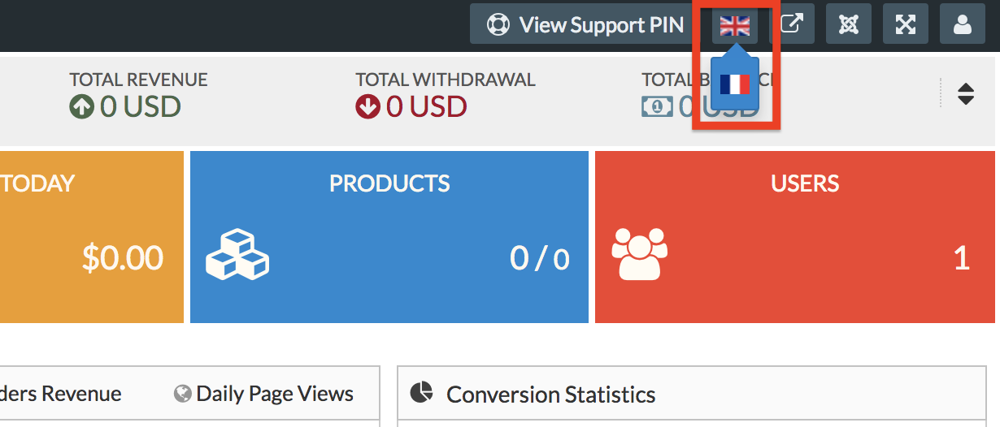
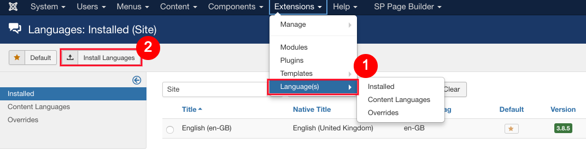
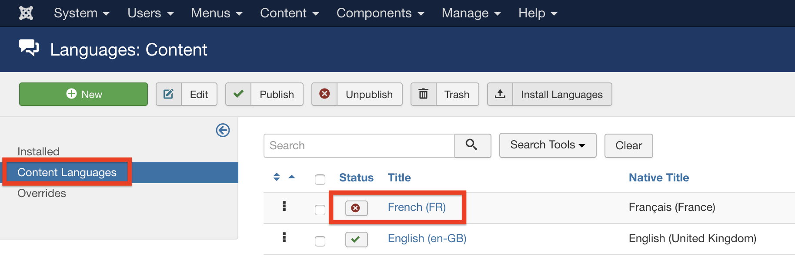
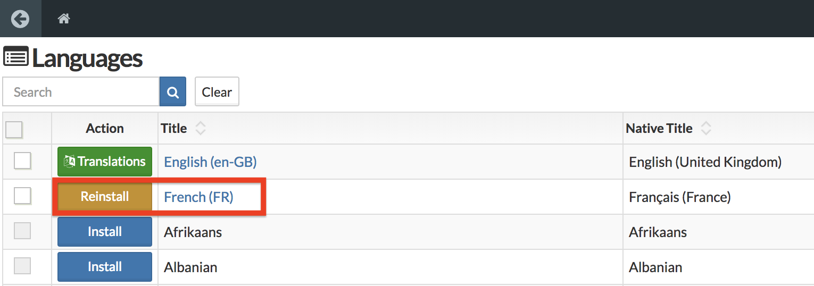

In sellacious, you can install the languages in one click. You can install languages from sellacious as well as from Joomla.

**Installing languages from sellacious:**
1. To install languages in sellacious go to Sellacious Backend > Languages.
2. Search your language and click on install beside the language name. We'll proceed with the French language in this documentation.

3. Now this language is installed on your site to translate.
4. Click on the languages in the drop-down. You'll see the list of languages available in sellacious.

---

**Installing languages from Joomla:**
1. To install language from Joomla Go to Joomla administrator > Extensions > Languages.
2. Click on Install languages and install the language you want. We'll proceed with the French language in this documentation.

3. Go to Joomla administrator > Extensions > Languages > Content Languages. Publish the language you installed.

4. Go to Sellacious backend > Languages. Reinstall the language you installed in Joomla.

