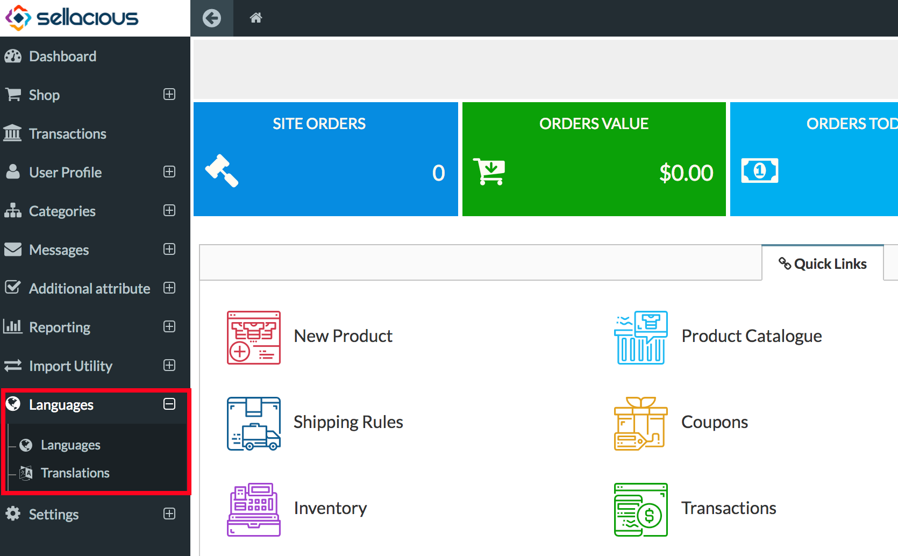
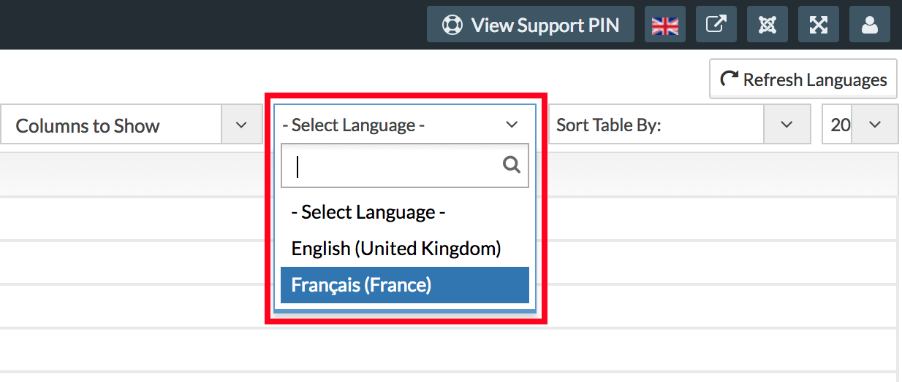
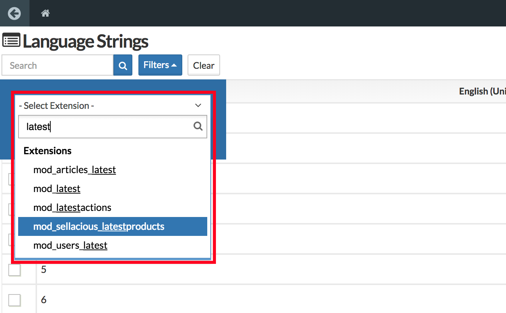
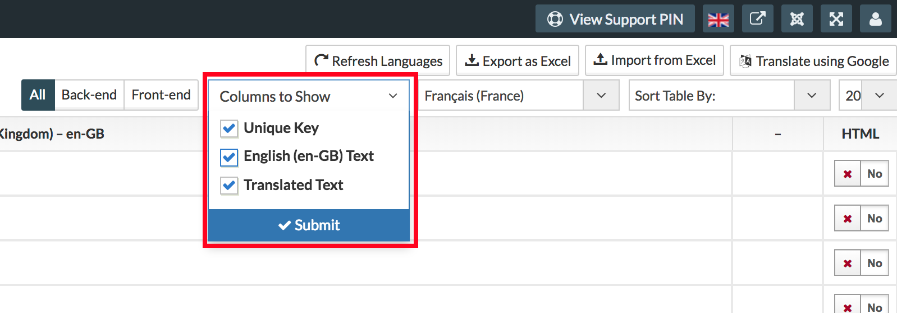
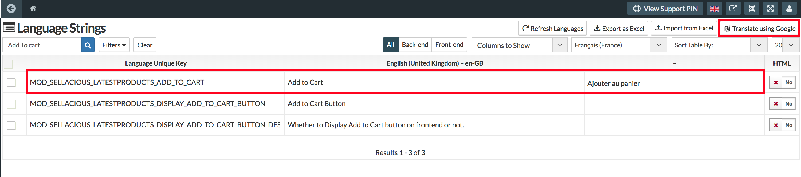
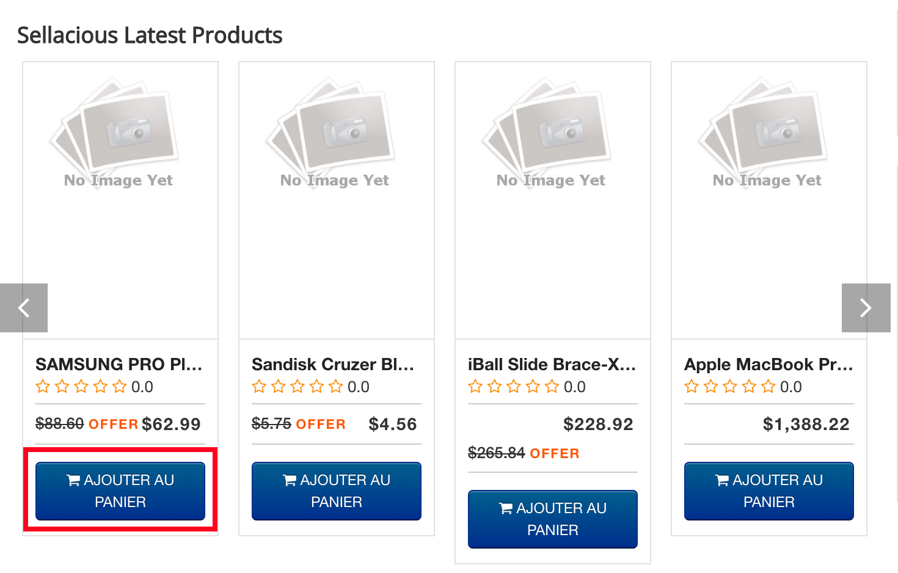
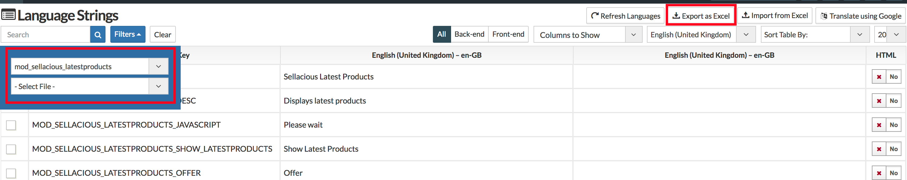

After language installation, you can translate your site easily from the sellacious backend. In Sellacious there are three ways to translate the site.
1. Translating using Google.
2. Manual translation.
3. Importing translations from Excel.

---

**Translating using Google:**
1. To translate using Google go to Sellacious backend > Languages > Translations.

2. Select the language in which you translate your site.

3. Select the extension or file from filter you want to translate. We'll translate the module latest product module.

4. Select the column you want from the columns to show. We suggest selecting all columns.

5. Select the Language key you want to translate and click on Translate Using Google. We'll check the Key for _Add to Cart_.

6. You can check your translation in frontend/backend now.

---

**Translating Manually:**
1. To translate manually, follow the above steps to step 4.
2. In the third column submit the translation of the key and press enter or change the row.
3. You can check your translation in frontend/backend now.

---

**Importing translations from Excel:**
Importing translation from excel is the quickest way to translate your site.

1. To translate a specific extension/module/plugin/component easier, you can filter them from the filters and export it. We'll check the module latest product module.

2. You get .xlxs file, and you can put your translation in the third column or in the column which has the name of your language.
3. Import the exported .xlxs file.
4. You can check your translation in frontend/backend now.
