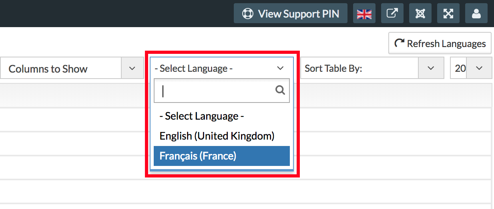
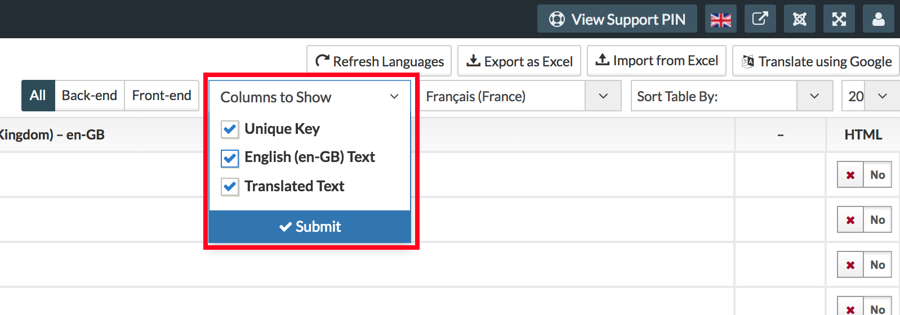

From backend of sellacious, you can also translate sellacious backend. In this document, we'll translate left menus. To translate sellacious backend first install the language you want. You can know about language installation in the sellacious form here. [How to install language in sellacious?](https://www.sellacious.com/documentation-v2#/learn/languages/installing-languages)

After language installation, you can switch to your language from switcher on the top right.

Now to translate go to Languages > Translations. Select the language and columns as described before here.

In filters, search for menu, select the file.

You can now translate the backend left menu.
 