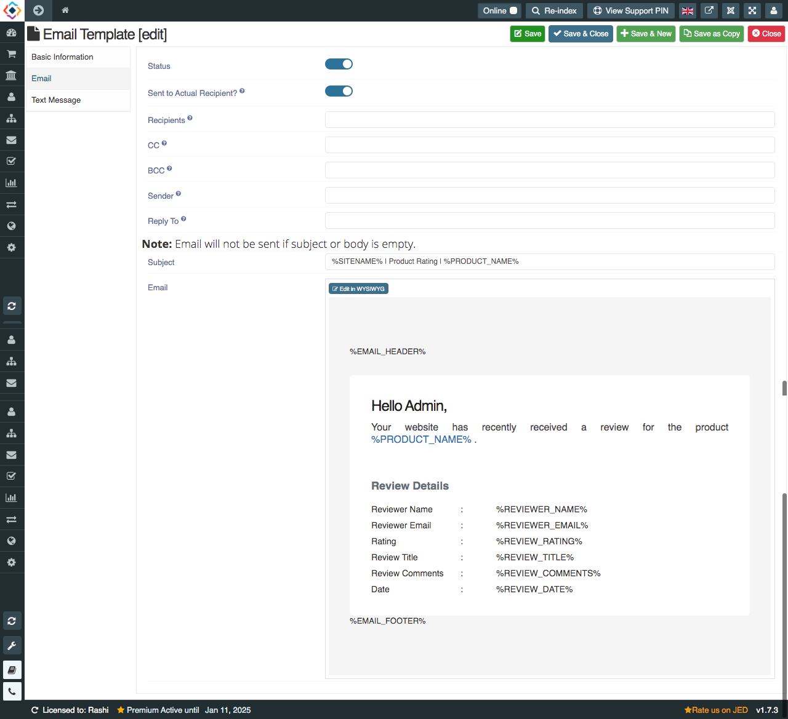
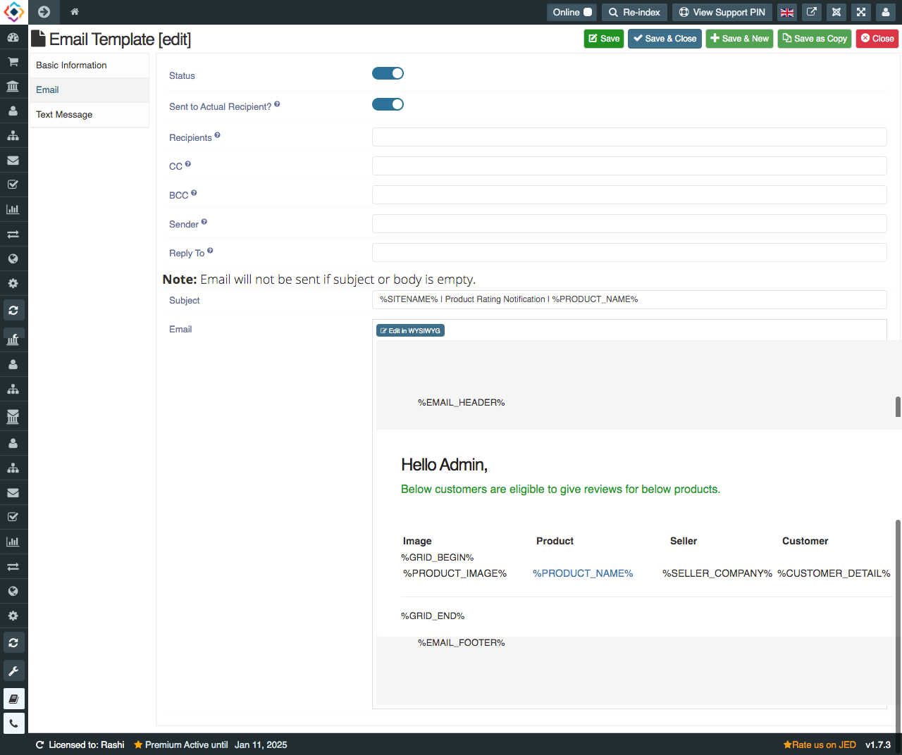

We have two review rating email template, these are:
1. PRODUCT RATING SUCCESS
2. PRODUCT RATING NOTIFICATION

1.**PRODUCT RATING SUCCESS**: When any user gives rating to the product, rating success email goes to admin, product's seller and buyer. In email template, we have 3 different tabs that contain diff info. 
* **Basic Information**: In basic information, there are all short codes that we can use in email template for admin, seller, and user.

* **Email**: In email, you can set email subject in subject text box. After that, you can design your own email template for rating success email with the help of short codes in basic information.

* **Text Message**: With email, you can send text message as well to user, admin and seller. You just need to enter the text message info in message body with shortcode.

2. **PRODUCT RATING NOTIFICATION**: Product rating notification will be sent to concerned persons based on the selected days in email template and also the status you have set in "Allowed Product Statuses for Review". This email will be sent to customer, seller, admin based on selected days of template.

* **Basic Information**: In basic information, there are all short codes that we can use in email template for admin, seller, and user. Also here you can choose after how many days of order placed these reminders should be sent.

* **Email**: In email, you can set email subject in subject text box. After that, you can design your own email template for rating notification email with the help of short codes in basic information.

* **Text Message**: With email, you can send text message as well to user, admin and seller. You just need to enter the text message info in message body with shortcode.

For Product rating notification, we have two methods to send email and text message. 1. Run with Cron only , 2. Run on every Page Load. You can find these configuration in Setting->Global Configuration->Reviews & Ratings

Firstly, product rating notiifcation will be sent after the status reach on that state that you have set here "Allowed Product Statuses for Review". If you dont save any status here, Default status will be Delivered.

**Execute Method**: We have two methods to execute product rating notification email. 
**1. Run with Cron only**: When you have enabled 'CRON Job Only'. Then you must pass a CRON Key to validate CRON calls. Empty CRON key is not allowed. The CRON is the time-based job scheduler used to schedule the jobs to run periodically at fixed times, dates or intervals.
Use this URL for CRON Job: http://yourwebsite.com/index.php?product_rating_notification=YOUR_CRON_KEY

**2. Run on every Page Load**: If you select run on every page load, you dont need to cron key after site URL. It will run by own on every page load. 