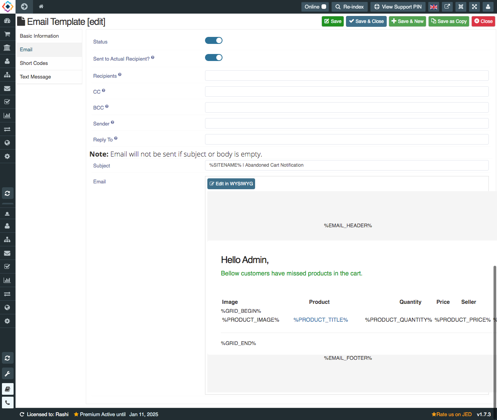

**Written by**: Rashi Gupta
**Date**: 27-10-2020
**Compatibility**: Sellacious v2.0.0-Beta1+

Abandoned Cart Email Notification is a follow-up email sent to customer who has added items to their cart and gotten through a portion of the checkout and then left the site without purchasing. Also abadoned cart notification email sent to admin as well to notify that these customers left the items in cart.

In abandoned cart notification, we have 2 template: 1. Admin, 2. Customer(self).

**1. Admin Template**: Admin template is for admin, when any user left items in cart then notification will also sent to admin based on the number of days selected in **Basic Information Tab**.

In **Email Tab**, you can set subject of email. Also click on edit button to design the email for admin with help of shortcodes.

In **Text Message** tab, you can also send text message for abandoned cart with mail.

**2. Customer Template**: In admin and customer template, all three tabs are same basic information, email, text message. In email tab, you can design differnt email for customer accordingly with WSIWYG editor.

To send emails for admin and customer, you need to exceute methods from **Setting->Global Configuration->Abandoned Cart Notification**

**Execute Method**: We have two methods to execute abandoned cart notification email.
1. **Run with Cron only**: When you have enabled 'CRON Job Only'. Then you must pass a CRON Key to validate CRON calls. Empty CRON key is not allowed. The CRON is the time-based job scheduler used to schedule the jobs to run periodically at fixed times, dates or intervals.
Use this URL for CRON Job: http://yourwebsite.com/index.php?abandoned_cart_key=YOUR_CRON_KEY

2. **Run on every Page Load**: If you select run on every page load, you dont need to enter cron key after site URL. It will run by own on every page load.