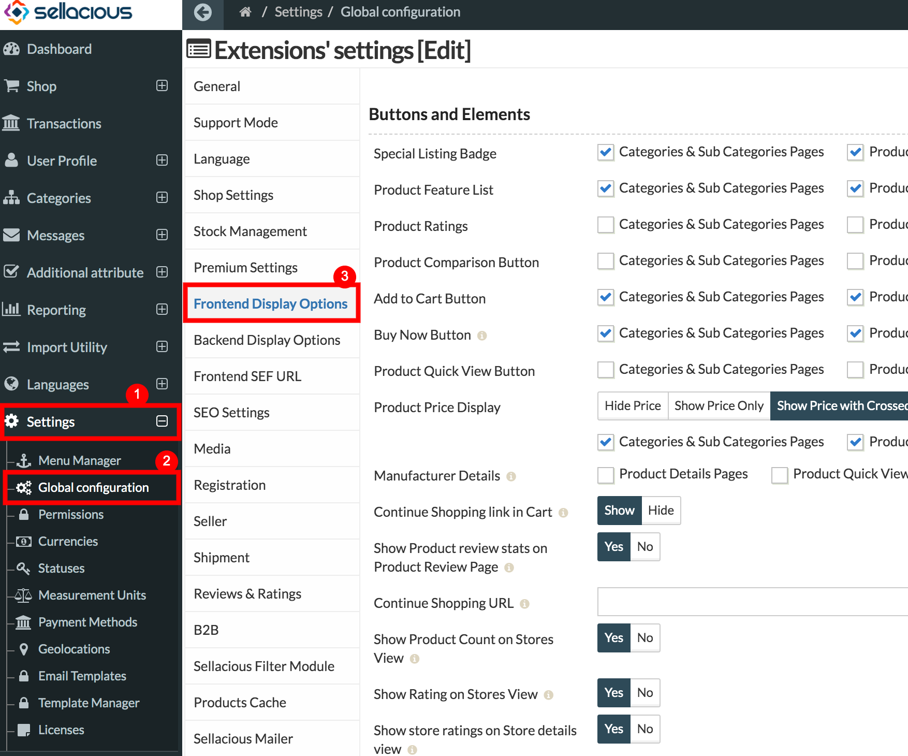
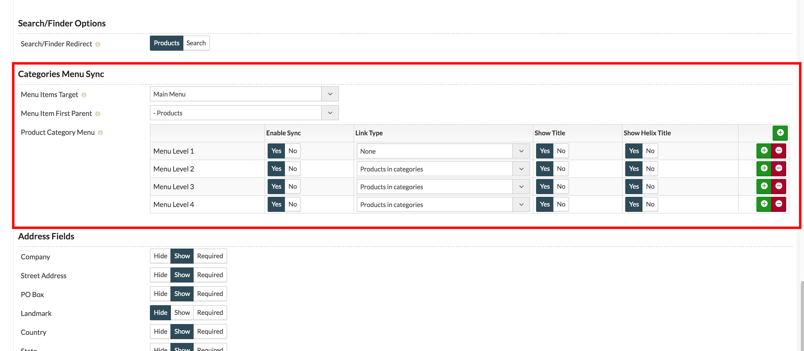
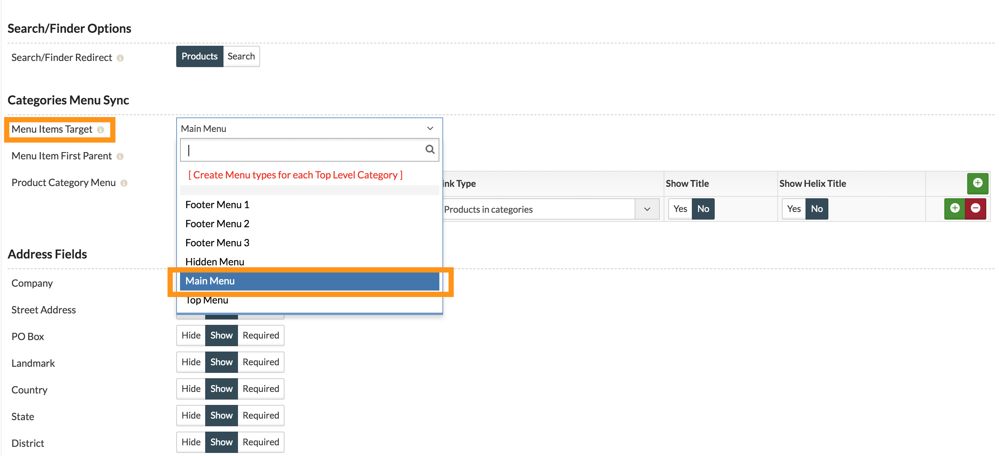
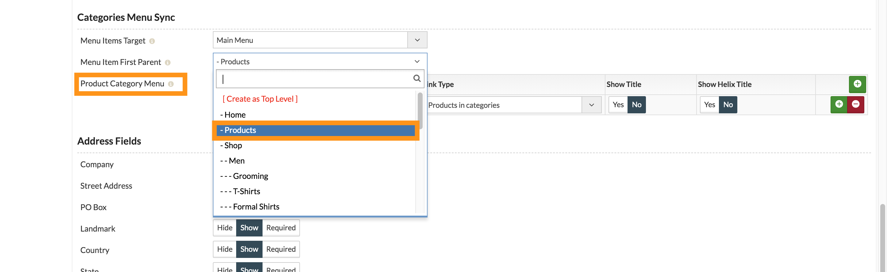
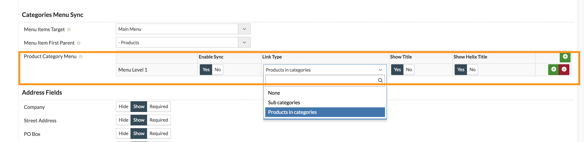
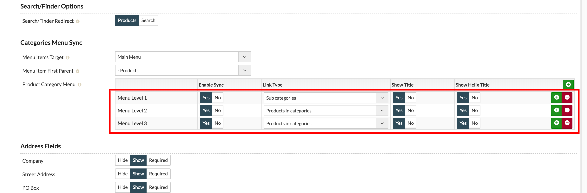
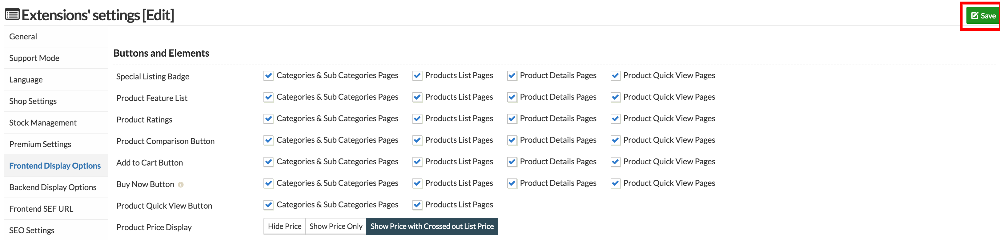
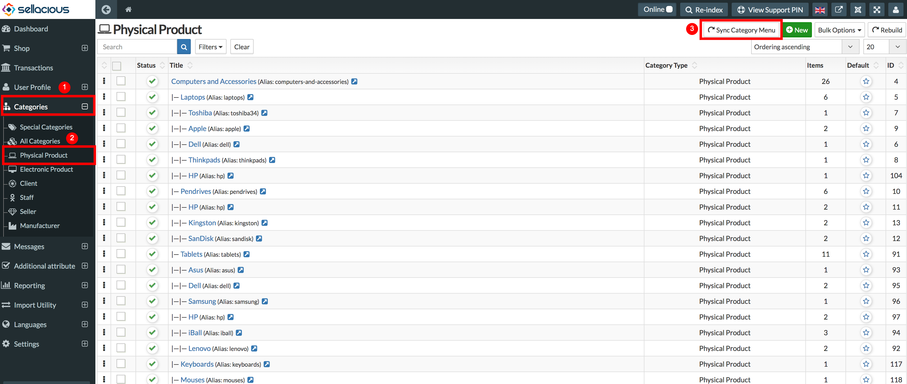

This feature of sellacious allows you to Sync your sellacious categories to Joomla Menu, so you don't need to create menus one by one for sellacious categories.

To use this feature:

1. Go to Sellacious Backend > Settings > Global Configuration > Frontend Display options.

2. In this tab, there's an option Categories Menu Sync.

3. Select the Menu item Target. In this Doc we're selecting Main menu of Squick Template.

4. Select the Menu Item First Parent. This is to select under which menu you want your categories. You can also select to create top level categories as New menu item. I have created a new menu **Products** in main menu.

5. Configure the Product Category Menu. _Enable Sync_ and _Show Title_ should be yes, to show categories on frontend.

>You can select more menu level if you want to show the child categories. _Menu Level 1_ is for the Top level category and it goes so on.

6. Now save this configuration from top-right of the page.

7. Now, go to Sellacious Backend > Categories > Physical Categories and click on Sync Category Menu.
> If you want to sync electronic categories, go to Sellacious Backend > Categories > Electronic Categories.

