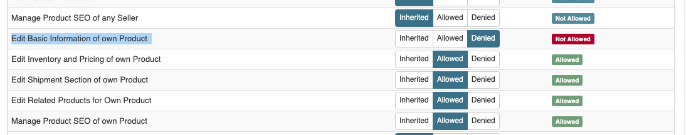
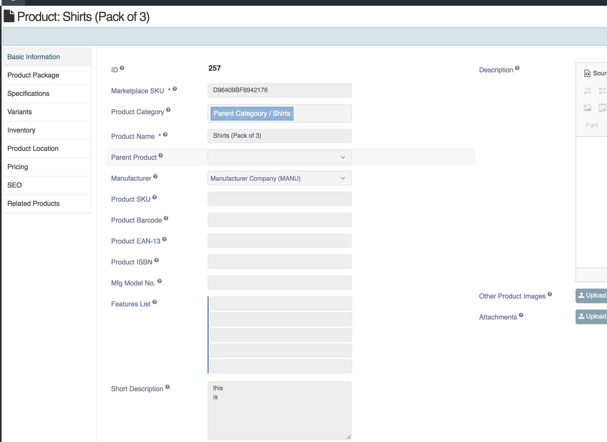

**Written by**: Rashi Gupta
**Date**: 24-10-2020
**Compatibility**: Sellacious v2.0.0-Beta1+

**Main Menu**: You can choose a menu to be used for the main navigation menu for sellacious backend. If you want to use system menu, you can select Use System Preset. If you want menu accordingly, you can make menu from menu manager and set the menu from here by selecting "Sellacious Backoffice Menu".

**Show Ratings in Catalogue**: You can choose whether to show Ratings Column in Product Catalogue or not in backend.

**Show Orders in Catalogue**: You can choose whether to show Orders Column in Product Catalogue or not in backend.

**Show Stock in Catalogue**: You can choose whether to show Stock Column in Product Catalogue or not in backend.

**E-Product Media Versioning**: Choose whether you want to enable versioning for e-product media files. This is useful where you are selling updates for same file in your products, such as software or games.

**Show Variant Specification**: You can choose whether to show variant specifications in product edit backend and product detail page frontend

**Allow HTML in Product Short Description**: You can choose whether to allow html tags in Product Short Description, without the editor.

#### **Allow URL in product Images/Attachments:**
This config allows you to add external images/attachment(url) for you product image.

After enabling it you will get option to add image url in product edit form for product/variants and external attachment url.

#### Inaccessible Product fields:

This config allows us to show disallowed product as disabled fields in product edit.

For example if basic info is not allowed from permission

these fields will show as disabled

**Product Editing Fields**: You can choose which of the following optional fields you want to use while editing a product in backend.

**Whats in the box:**
This provides you a text feld in product edit to save some in formation abot what are the things included in the product.

Which then shown on product details page

NOTE: if you want to give option to sellers to save thier own whats in the box, **enable what in the box** config in seller catergory.

now sellers can have thier own whats in the box

in this case seller whats in the box will be shown on prduct details page

