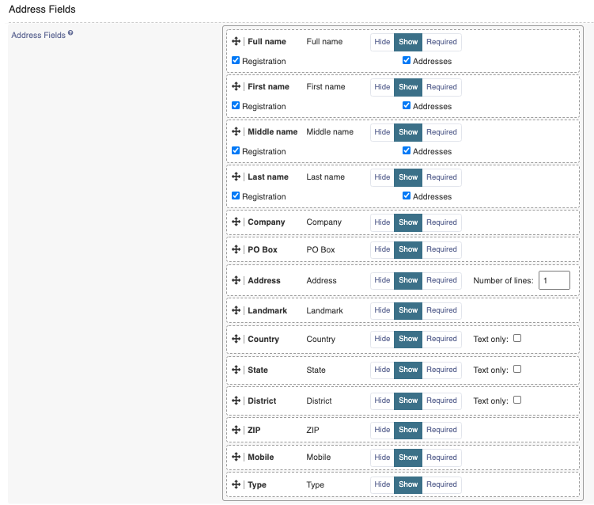
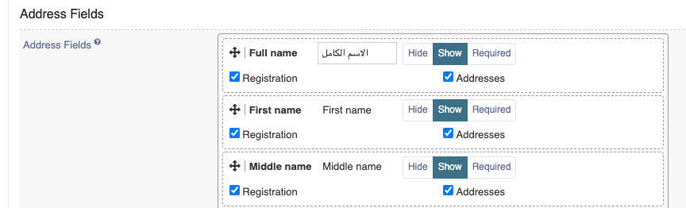
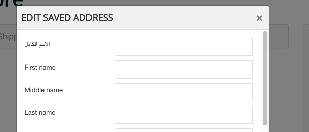
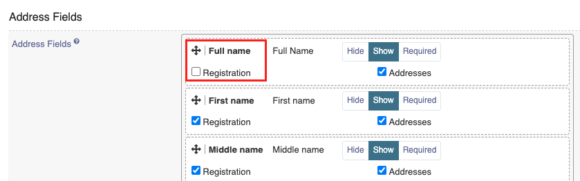
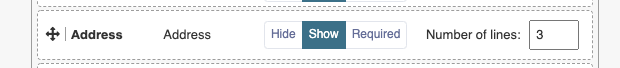
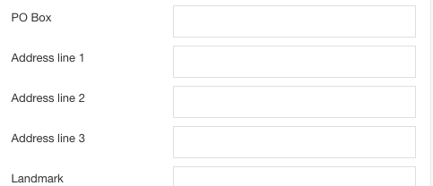
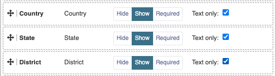
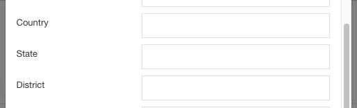

(Compatibility: Sellacious v2.0.0-Beta1+)
**Address Fields**:

New form field is Added to manage address fields settings like show/hide/mandatory, label value, ordering etc. In this new form label value can be changes according to language and it will show particular label wherever address fields are rendering. 

Option is added to show/hide name fields on registration page or addresses or both. if field is unchecked it will not show.

No. of address lines can be selected from here for example if we have set no. of lines 3 in address, it will show three fields for adsress

Country, state, district can be shown as select2 dropdown or as text field. if checked text only these fields will show as text field.
**NOTE:** Do not change this again and again from one to another, otherwise geolocation saved with dropdown will show as location id. So in this case best practice is to enable one type of field for your shop from begining.

 **Zip code format**:In address field, You want to enter the ZIP code format in the frontend or not. Here you can have three options: Hide, show and Required. If you choose hide then it will not be displayed on the front end. If you choose show, then it will displayed on the front end.If you choose the required, Then it will be act like the mandatory field.
 **Mobile Number Format**:In address field, You want to enter the Mobile number format in the frontend or not. Here you can have three options: Hide, show and Required. If you choose hide then it will not be displayed on the front end. If you choose show, then it will displayed on the front end.If you choose the required, Then it will be act like the mandatory field.