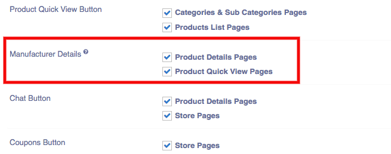
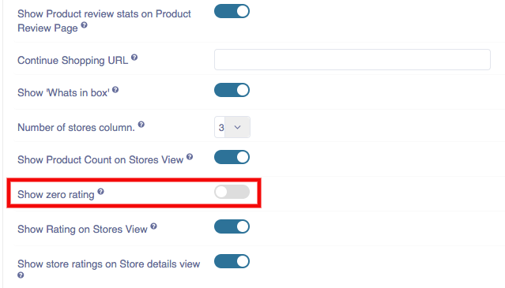

### Frontend Display Options
**Buttons and elements**: You can tick the once you want to apply on your product.
 **Special listing Badge**: Special listing badge is the type of product listing in which the products are to be shown as the H,B,F. 
H,B,F represents the special categories for the products. You can assign them on products from here directly.
H stands for Highlighted feature
B stands for the Bordered feature
F stands for the featured feature.
You can apply the special listing badge for categories & subcategories, Products list pages, Product details Pages and Product quick view pages.
 **Product Feature list**: You can choose whether you have to apply the product feature list on  categories & subcategories, Products list pages, Product details Pages and Product quick view pages.
 **product Ratings**: You can choose whether you have to apply the product ratings  on  categories & subcategories, Products list pages, Product details Pages and Product quick view pages.
 **Product comparison Button**: You can choose whether you have to apply the product comparison Button on  categories & subcategories, Products list pages, Product details Pages and Product quick view pages.
 **Add to cart Button**: You can choose whether you have to apply the add to cart button on  categories & subcategories, Products list pages, Product details Pages and Product quick view pages.
 **Buy Now Button**:You can choose whether you have to apply the Buy now button on  categories & subcategories, Products list pages, Product details Pages and Product quick view pages.
 **product quick view button**: You can choose whether you have to apply the product quick view button on  categories & subcategories, Products list pages, Product details Pages and Product quick view pages.
 **Manufacturer Details**: You can choose whether you have to apply the Manufacturer Details on product details page & product quick view page.

**Chat Button**: You can choose whether you have to apply the chat button on product detail page and store page.

**Coupons Button**: You can choose whether you have to apply the coupons button on store page.

**Discounts Button**: You can choose whether you have to apply the discounts button on store page.

**Social Links**: You can choose whether you have to apply the social links button on store page.

 **product price display**:You can choose whether you have to apply the product price Display on  categories & subcategories, Products list pages, Product details Pages and Product quick view pages.

**continue price display**: You can choose whether you have to apply the continue price display on  categories & subcategories, Products list pages, Product details Pages and Product quick view pages.
 **continue shopping link in cart**:  You can choose whether you have to apply the continue shopping link in cart on  categories & subcategories, Products list pages, Product details Pages and Product quick view pages.
 **Continue shopping URL**: You can choose whether you have to apply the continue shopping URL on  categories & subcategories, Products list pages, Product details Pages and Product quick view pages.
 **Show product count on stores views**: You can choose whether you have to apply the show product count on stores view on  categories & subcategories, Products list pages, Product details Pages and Product quick view pages.
 **Show zero rating**: You can choose whether you want to show/hide zero ratings on your website.
 **Show Rating on stores view**: You can choose whether you have to apply the show rating on stores view on  categories & subcategories, Products list pages, Product details Pages and Product quick view pages.
 **Download link on order detail**: You can choose whether you have to apply the download link on order detail on  categories & sub categories, Products list pages, Product details Pages and Product quick view pages.

**Sub Category Pages**
 **Select Layout**: You can select layout for category view pages. There are 6 layouts: 

1. Default: In default layout, category image is showing with number of product.
2. Elegant: In Elegant layout, category title, image and number of product is showing. 
3. Icontext: Icontext layout is showing on frontend like this: 
4. List: In list layout, only category list is showing. 
5. Textimage: 
6. Textonly: In Textonly layout, category name is showing with number of products.

 **Category Sub-Category count**: whether to show sub-category count for each category in frontend categories list.You can show or hide the category sub-category count from the front-end.
 **Category product count**: Whether to show product count for each category in fronetend categories list. You can show or hide the category product count from teh front end..
 **Category Description**: Whether to show category description and details on subcategory pages in frontend. You can show or hide the category description from teh front end.
 **Category Products**: Whether to show a list of products in the selected category on subcategory pages in frontend.
 **Category page product limit**:  Number of product to display on category pages. You can enter the number of pages you want to display the product in the front end.

**Products Pages**
 **Product Image Height**: Product image container height in the product detail pages. You can adjust the height of the product page in the front end.
 **Product image width**: product image container width in the product detail pages. You can adjust the width of the product page in the front end.
 **Image Display Size**: Choose how to adjust images within the images slider container.The aspect ratio of the images will always be maintained. You can have two options: Fit to container and Completely Fill container(May be partially hidden).
 **List layout**: Select the default layout for the list on front-end. You can select the view of the products in the front end. It can be masonry, Grid and List. 
 **Show layout switcher**: Select whether the users will be able to switch the list layout between grid and list format. If you want to switch then click on the ‘yes’ otherwise click on the ‘No’.
 **Product block layout**: You can select here product block layout for frontend product list page. There are 5 layouts: 1. Default 2. Elegant 3. Jskart 4. Minimal 5. Travelkit

**1. Default:** In Default layout, add to cart, buy now, compare ,view, ratings are showing on frontend.
**2. Elegant:** In Elegant layout, all buttons are showing except buy now on frontend.  
**3. Jskart:** Jskart layout on frontend. 
**4. Minimal:** In Minimal layout, only price is showing on product list page. 
**5. Travelkit:** In travelkit layout, rating is also showing with price.

 **Hide out of stock products**: Whether to hide the Out Of Stock products from the frontend listing completely.If disabled they will be shown as out of stock. If you want to hide the out of stock of the product then click on the ‘yes’ otherwise click on the ‘No’ button.
 **Hide Zero Price products**: Whether to  hide the products with no price from the frontend listing completely.If disables, They will be shown as out of stock. If you want to hide zero price products then click on ‘yes’ otherwise click on ‘No’.
 **Hide ZIP code Filter**: Choose whether to show or hide the zip code filter in the products pages. If you want to hide ZIP code filter the click on ‘Yes’ Button otherwise click on ‘No’ button.
 **Hide category Filter**: Choose whether to show or hide the category filter in the products pages.If you want to hide category filter the click on ‘Yes’ Button otherwise click on ‘No’ button.

**Image Zoom Options**
 **Enable Image Zoom**: Choose whether to show Image Zoom or not. If you want to enable the click on the ‘yes’ otherwise click on ‘No’ button.
 **Image Zoom Type**: Choose the magnifier Effect. You can choose Lens or window.
 **When you choose Lens**:  Image zoom  Options > Lens
 **Lens Size**: Define Lens size. You can enter the lens size here.
 **When you choose  window**: Image zoom Options > Window
 **Zoomed Window Width**: Define a outer window width of image preview.
 **Zoomed Window Height**: Define a outer window height of image preview.
 **Window Lens Border Width**: Define a border width of lense on Image.
 **Window Lens Border Color**: Define a border color of lense on Image.
 **Window Lens Background Color**: Define a background color of Lens area, always choose alpha value.
 **Easing**: Choose whether to activate easing on zoom or not.

 **Zoomed Area Border width**: Define a border width of product image preview. You can change the border width accordingly.
 **Zoomed area border color**: Define a border color of product image preview.You can select the color from here.
 **Zoom Type on mobile**: Choose whether to set Lense or Disable on mobile view. You can choose Lens or None.
 **Lens size on mobile**: Define Lens size on mobile view. Enter the number of lens size you want to display in mobile.

**Category Menu Sync**
 **Menu Items Target**: Choose where the category menu items will be created. You can select the option for displaying the menu items. The drop menu will list all the  positions.
 **Menu Item First parent**: Choose a menu parent item under which the top level category menu items will be created. Menu item hierarchy will minimum the categories hierarchy.
 **Product category menu**:  Choose settings for creating automatic menu for frontend based on product categories.Disabling sync for any level will disable it for all levels below it irrespective of their setting. You can enable sync with the menu level and you can add the menu level by clicking over the plus icon.

### New Address Fields:
(Compatibility: Sellacious v2.0.0-Beta1+)

New form field is Added to manage address fields settings like show/hide/mandatory, label value, ordering etc. In this new form label value can be changes according to language and it will show particular label wherever address fields are rendering. 

Option is added to show/hide name fields on registration page or addresses or both. if field is unchecked it will not show.

No. of address lines can be selected from here for example if we have set no. of lines 3 in address, it will show three fields for adsress

Country, state, district can be shown as select2 dropdown or as text field. if checked text only these fields will show as text field.
**NOTE:** Do not change this again and again from one to another, otherwise geolocation saved with dropdown will show as location id. So in this case best practice is to enable one type of field for your shop from begining.

 **Zip code format**:In address field, You want to enter the ZIP code format in the frontend or not. Here you can have three options: Hide, show and Required. If you choose hide then it will not be displayed on the front end. If you choose show, then it will displayed on the front end.If you choose the required, Then it will be act like the mandatory field.
 **Mobile Number Format**:In address field, You want to enter the Mobile number format in the frontend or not. Here you can have three options: Hide, show and Required. If you choose hide then it will not be displayed on the front end. If you choose show, then it will displayed on the front end.If you choose the required, Then it will be act like the mandatory field.
