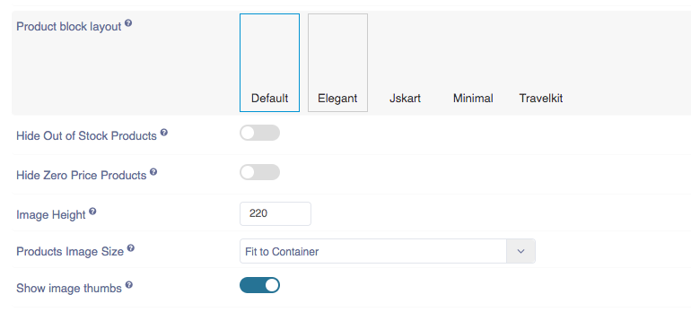
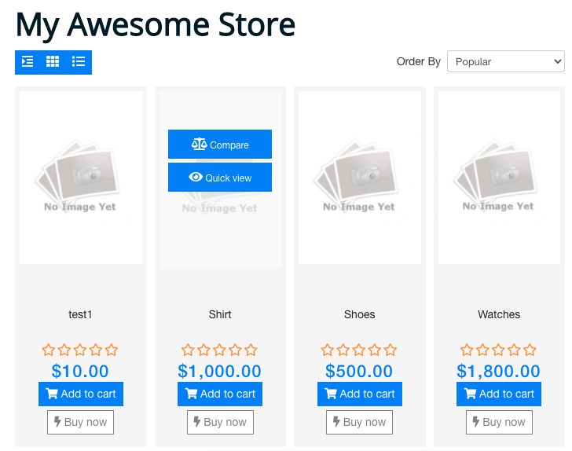
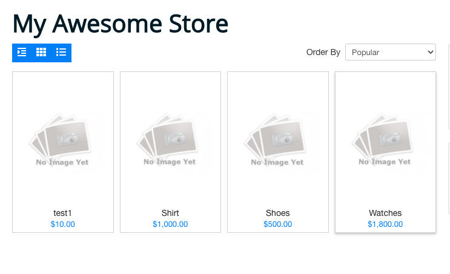
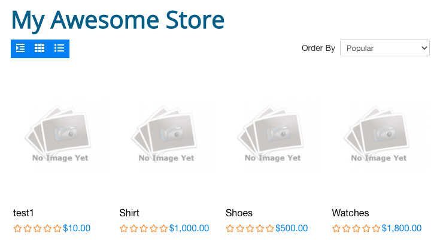

 **Pagination Type**: Choose how you want the users to navigate through a multi-page list of items.
1. Page number buttons
2. Load more buttons
3. Scroll to load more.

 **Layout Switcher**: Choose which switcher you want to show. Switcher will hide if only 1 option selected. if no option selected then all options will show
 **Default Layout**: Select the default layout for the products list on front-end, by default it is Grid
 **Show layout switcher**: Select whether the users will be able to switch the list layout between grid and list format. If you want to switch then click on the ‘yes’ otherwise click on the ‘No’.
 **Product block layout**: You can select here product block layout for frontend product list page. There are 5 layouts: 1. Default 2. Elegant 3. Jskart 4. Minimal 5. Travelkit

**1. Default:** In Default layout, add to cart, buy now, compare ,view, ratings are showing on frontend.
**2. Elegant:** In Elegant layout, all buttons are showing except buy now on frontend.
**3. Jskart:** Jskart layout on frontend. 
**4. Minimal:** In Minimal layout, only price is showing on product list page. 
**5. Travelkit:** In travelkit layout, rating is also showing with price.

 **Hide out of stock products**: Whether to hide the Out Of Stock products from the frontend listing completely.If disabled they will be shown as out of stock. If you want to hide the out of stock of the product then click on the ‘yes’ otherwise click on the ‘No’ button.
 **Hide Zero Price products**: Whether to  hide the products with no price from the frontend listing completely.If disables, They will be shown as out of stock. If you want to hide zero price products then click on ‘yes’ otherwise click on ‘No’.
 **Image Height**: Enter the Image Height of Products listing view.
 **Products Image Size**: Choose how to adjust images within the image container. The aspect ratio of the images will always be maintained.
 **how image thumbs**: Choose whether to show image thumbs below the product's image in product list. This will let you see all of the product's images in products list pages itself.
 **Default Ordering of Products**: You can select the default ordering of products listing in the list page. We have 5 types of ordering: 1. Popular, 2. Rating, 3. Newest First, 4. Lowest Price, 5. Highest Price
