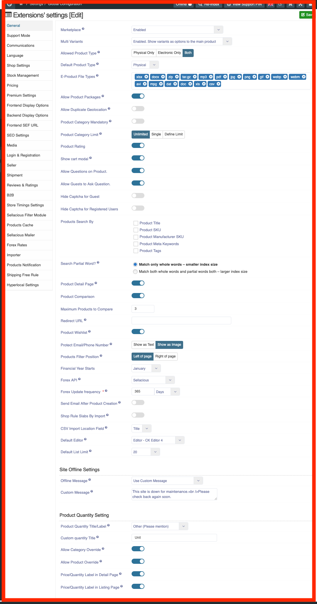

#### **General tab Text Fields:**

**Market place**: Here You can Choose whether to apply the listing of the products from multiple seller or not.
* **Disabled:** If marketplace is disabled then your shop will not considered as multi seller. 
* **Enabled:** If marketplace is enabled then your shop will considered as multiseller. Therefore, Many sellers can     collaborate with your shop to sell the products. 
* **Show product for each seller separately:** Enable the listing of the products from multiple seller but the           product of each seller will be shown separately in your website.

**Multi variants:** It represents the same product with different features are to be specified. For example, the color of the product,Size of the product etc.
You can set the variants from the product catalogue in sellacious admin panel.
* **Disabled:**  To disable the multi variants feature in sellacious.
* **Enabled.show variants as options to the main product:** You can use this feature to add multi-variants to main       products in your shop. 
* **Enabled.show each variant as a separate product:**  You can use this feature to add multi-variants to seperate       products in your shop. 

**Allowed product type**: In this feature you can select the type of products you want to display on the front end.   It can be physical product, Electronic product or both. 
* **Physical only:** Physical product represents the products physical in nature. For example: Laptops,                 Mobile phones etc. 
* **Electronic only:**  Electronic products are the products electronic in nature and non-tangible. For example: E-     books. 
* **Both:** This option is for both physical and electronic products.

**Default Product Type**: You can choose which product type should be selected by default. These types are: Physical, Electronic, Package.

**E-product file types**: In this feature select the type of file for e-products. E-products are the electronic products i.e, E-Books.
Check the type from the following options: Image, Document, archive, Audio, Video.

**Allow product Packages**:  Choose whether the Products packages are allowed or not. A package product is a pre-configuration set of compatible individual products shipped as a whole. Product Packages has a combination of physical to physical, Electronic to Electronic, Physical to Electronic products. 

**Allow duplicate geolocation**: choose whether to use two geo locations with same names and with same parent region. We can use this feature in different locations with same name.For example, Beverly Hills in California and Beverly hills in Texas. 

**Product Category Mandatory**: Choose 'Yes' if you want to require all the products to be assigned at least one category or 'No' to make category selection optional for products.

**Product Category Limit:** Set the number of allowed categories to select in product, i.e. unlimited, single, define limit.

**Product rating**: This feature allow the consumers to rate your products from frontend. 
  By enabling this feature product ratings option will be available in the front end. 
  If you dont want to give rating options to the consumer then disable it. 

**Show cart modal**: You can choose whether to show cart modal everytime when product added to cart or only show add to cart message.

**Allow Questions on Product**: If you want buyer to ask question on product to allow questions on product, enable it.

**Allow Guests to Ask Question**: If you want guest can also ask question on product, enable it.

**Hide Captcha for Guest**:

**Hide Captcha for Registered Users**:

**product detail page**: The product detail page is the detailed page of the product which is shown in the front end. The features and the description of the products added on each product to be shown here.

**product comparison**: Select whether you want to compare the products with other products or not.There is an option on every product to compare.If you want to compare then tick on the compare button to compare the products. You can enable or disable the comparing feature from here.The product comparison chart includes price, Rating, Sold by, features, product summary, Life style, color, storage type and what’s in box.

**maximum products to compare**: Select the Maximum number of products, which can be compared at one time. Suppose you set its value 5, then at one time only 5 products can be compared.

**Redirect URL**: The user  will be redirected to this page when a requested page either does not exist or it has been disabled. You can add a redirect URL if the link of your shop is not working. Redirect the URL means making the web page available under more than one URL address. When a web browser attempts to open a URL that has been redirected, a page with a different URL is opened.

**Product Wishlist**: If you want that buyer can add products in wishlist, enable this configuration.

**Protect email/phone number**: Protect email/phone number helps you To prevent the information from the others.you can choose the text or the image to protect your details. The call/email for price information can be used by spammers/bots to exploit the sellers. Displaying these information as image can prevent this to significant level.

**products filter position**: Choose where to show the products list page filters.If you want to apply on the left of the page the click on the left of page and if you want to apply the right of the page then click on the right of page.

**financial year starts**: The starting financial year of your shop. The one year period of financial statements of a company is prepared is referred as the financial period.

**forex API**: The API of the Forex can be used from  the google finance and Fixer I.O. The Forex represents the conversion of the currencies. Fixer.IO is an API that returns foreign exchange rates based on daily and historical feed from the european central bank. Google Finance is a website it provide service featured business and enterprise headlines for many corporations including their financial decisions and major news events.

**Forex update frequency**: choose how often the forex rates should be fetched. Only the latest fetched rates are used for internal currency exchanges within sellacious. The updation of the Forex after a particular frequency. You can set the update frequency from here. You can set according to the days, minute and Hours.

**Send Email After Product Creation**: Choose whether to send email after product creation or not.

**Shop Rule Slabs By Import**: Choose whether you want to import Shop rule slabs using CSV import. If disabled, you will be able to set them manually in the grid provided and country, state, zip filtering will not be available.

**CSV Import Location Field**: Choose the Field you want to enter for Location when importing rules from CSV. These are: 1. Code, 2. Title, 3. Id

**Default Editor**: Select the default text editor for your site. Registered Users will be able to change their preference in their personal details if you allow that option.

**Default List Limit**: Sets the default length of lists in the Control Panel for all users.

**Site Offline Settings**

**Offline Message**: Display or not a Frontend message when the site is offline. The custom offline message uses the value defined in the 'Custom message' field. The language offline message uses the value defined in the site language ini file.

**Custom Message:** The custom offline message will be used if the 'Offline Message' field is set to 'Use Custom Message'.

##Product Quantity Setting

These settings allow us to add custom quantity label to places wherever quantity label is being used in our shop, like details page,list page, modules,  quick view, checkouts, orders view, invoices and order emails.

From here etither we can use default from language or choose/write our custom quantity label.

Custom quantity on frontened

These settings can be overriden from category level and products level

The quantity lablel can be used as price/quantity (like $12/kg) by enabling "Price/Quantity Label in Detail Page/List page" configuration.

and it will show wherever price is displayed

