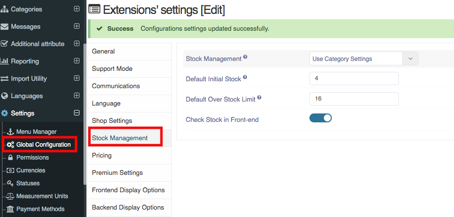

**Written By**: Rashi Gupta
**Date**: 12-06-2020
**Compatibility**: Sellacious v2.0.0-Beta1+

**Stock Management**: You can choose at what level the stock value can be set. If set to ‘Use Global Setting’ it would not be possible to enter stock at category level and product level, and once the stock ends the product will be marked as out of stock.

You can Manage stock from 3 ways:
1. From 'use global setting'
2. From 'use category setting'
3. From 'use individual product setting'

**Default intitial stock**: Set a default initial stock value for all products, this can be overridden in the category if stock management is set to category level. You can change the initial stock by scroll bar placed on the text box.

**Default over stock limit**: Set a default over stock sales limit value for all products, this can be overridden in the category if stock management is set to category level.

**Check Stock in Front-end**: If check stock in front-end is enable, it will check stock on frontend and show message "Insufficient stock" if stock is not present in that quantity.

**1. Use Global Setting**: If you set stock management setting is use global setting, stock+over-stock will be saved from global in product.
**2. Use Category Setting**: When you set stock management setting is use category setting, stock management tab is showing in category. From category, you can set stock management from 3 ways: 1. Global, 2. Category, 3. Individual Product

Global: If you save global in category, stock will be saved from global setting.
Category: If you save category, stock will be saved from category itself.
Individual Product: If you save individual product, stock will be saved from product.
**3. Use Individual Product Setting**: When you set stock management is use individual setting, stock will be saved from product.

If you enable the stock management button, stock will be shown in list like stock+over-stock.
If you disable the stock management button, stock will be shown in list like ∞
