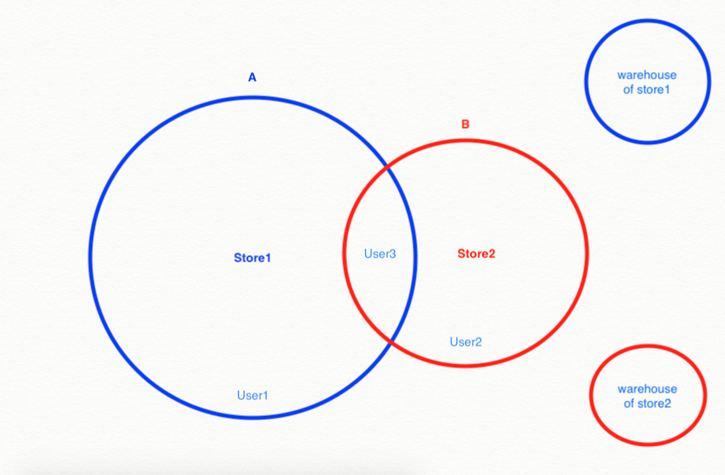

Hyperlocal is a major feature of sellacious. With the help of hyperlocal you can create your own store for local or international buyers. 

This hyperlocal package consists of a module and plugin. Which both are already built in sellacious latest version. We are upgrading this feature of sellacious day by day and adding many more additions to this feature.

_Hyperlocal is compatible to the sellacious version 1.6.x and above. If your site isn't updated yet to the latest sellacious, please update it to use hyperlocal and many more exciting feature of sellacious._

### Use cases for Sellacius Hyperlocal
Before we move to installation and configuration part lets understand use cases for Sellacious Hyperlocal. Basically there are three use cases of hyperlocal
1. Region based
2. Radius based
3. Product based

### Region Based: 
In region based, hyperlocal displays a search form to find products by Location in Sellacious. It is done by **Address matching by Region**. If Address Matching is selected as region, then Sellacious will search products by the selected region. For example, if it is City/District/State/Country then the results will be displayed from that particular City/District/State/Country.
In other words it show Stores which can deliver and products which can be delivered to user location.
**Note:** Sellers can can opt for multiple regions(City/District/State/Country) for delivery of their products.

Configuration for Region based [Click here](https://www.sellacious.com/learn/marketplace/hyperlocal#configuration-for-region-based)

### Radius Based:

In radius based, it will search products based on distance from users current location and specified distance around it. This may sometimes span across geo-political regional boundary, viz another state or city if they fall within given distance.
Seller will choose the radius within which he wants to avail delivery of his products and hyperlocal will create a circle based on geolocation data and if user falls within that circle he will see products from that seller.
For example there are two sellers owning store1 and store2,they will be able to deliver products within their radius.
Seller1 can avail products in circle A and seller2 can vavil products in circle B. Accordingly user can see products from the circle in which they reside and if users(like user3) fall in the intersection of both the circle they can see the products from both the sellers.

**Enterprise** version of sellacious supports **warehouse** functionality too which means a seller can have multiple warehouses with delivery capability in area where the warehouse is located. So now Seller can avail delivery in area where warehouse is located as well as the store radius.

Configuration for Radius based [click here](https://www.sellacious.com/learn/marketplace/hyperlocal#configuration-for-redius-based)

### Product Based:

Each product has Its Location and Product Coordinates saved with it so Sellacious Hyperlocal can filter it with this information irrespective of seller and warehouse.

### Installation and Configuration

After installing the sellacious version 1.6.x and above, to use hyperlocal go to the Sellacious backend > Settings. In Global configuration, you'll see the tab for hyperlocal settings.

To view these settings, hyperlocal plugin should be enabled. To enable this plugin go to Joomla Administrator of your site. You can access it through the https://yoursite.com/administrator. Go to Extensions > Plugins. Search for Hyperlocal. Enable this plugin and these settings will be enabled in sellacious backend.

Now to use Hyperlocal module, you need to save hyperloca settings. To publish the hyperlocal on your site, you need Google API key for your site. Below is the link for the documentation on how to get a API key.

https://developers.google.com/maps/documentation/geolocation/get-api-key

To use hyperlocal of sellacious, enable the API for Geocoding, Places and Timezone. Once these APIs are enabled for the key you're using, copy that key and paste it in Sellacious Backend > Settings > Global configuration > Hyperlocal.

After this you'll be able to publish the module in your site. To publish hyperlocal module, go to Joomla administrator > Extensions > Modules. Click on New button select the Sellacious Hyperlocal. There you can configure the module.

In Sellacious hyperlocal you can select either 'By Radius' or 'By Shippable Locations' for sellers. Sellers can also configure these settings from their profile for their store only. These settings can be handeled from frontend and backend.

### Configuration for Region based:
For region based filtering select by region in address matching tab in joomla administrator

and in Global Configuration of Sellacious backend

### Configuration for Radius based
For radius based filtering select by distance in address matching tab in joomla administrator

and in Global Configuration of Sellacious backend

