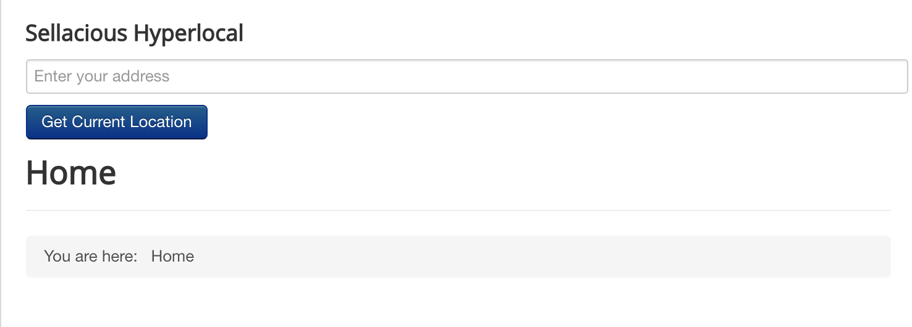

After installing the sellacious version 1.6.x and above, to use hyperlocal go to the Sellacious backend > Settings. In Global configuration, you'll see the tab for hyperlocal settings.

To view these settings, hyperlocal plugin should be enabled. To enable this plugin go to Joomla Administrator of your site. You can access it through the https://yoursite.com/administrator. Go to Extensions > Plugins. Search for Hyperlocal. Enable this plugin and these settings will be enabled in sellacious backend.

Now to use Hyperlocal module, you need to save hyperloca settings. To publish the hyperlocal on your site, you need Google API key for your site. Below is the link for the documentation on how to get a API key.

https://developers.google.com/maps/documentation/geolocation/get-api-key

To use hyperlocal of sellacious, enable the API for Geocoding, Places and Timezone. Once these APIs are enabled for the key you're using, copy that key and paste it in Sellacious Backend > Settings > Global configuration > Hyperlocal.

After this you'll be able to publish the module in your site. To publish hyperlocal module, go to Joomla administrator > Extensions > Modules. Click on New button select the Sellacious Hyperlocal. There you can configure the module.

