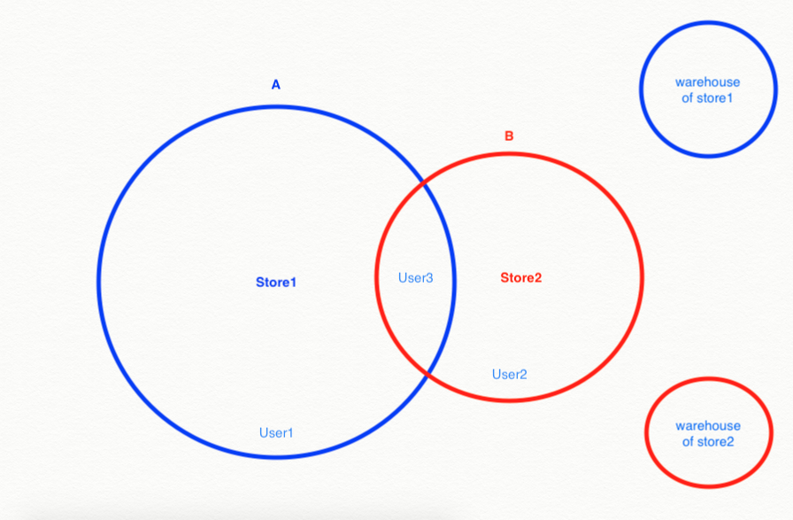
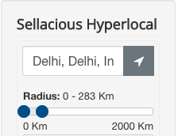

**Written by:** Indresh Maurya
**Date:** 25-05-2020
**Compatibility:** Sellacious v2.0.0-Beta1+

With the help of Sellacious Hyperlocal you can create your own store sensitive to user and product location. To use Sellacious hyperlocal you need Google Geolocation API key.To know how to get Google Geolocation API key visit https://developers.google.com/maps/documentation/geolocation/get-api-key

This hyperlocal package consists of a **Hyperlocal Module and Plugin**. Both are already built in sellacious latest version. To enable Sellacious Hyperlocal Go to Joomla backend Manage->Modules->New->Sellacious Hyperlocal and publish module.

### Use cases for Sellacius Hyperlocal
Sellacious Hyperlocal provides location sensitivity based on following use cases
1. [Region based](https://www.sellacious.com/learn/marketplace/hyperlocal#1-region-based)
2. [Radius based](https://www.sellacious.com/learn/marketplace/hyperlocal#2-radius-based)

### 1. Region Based 
Sellacious Hyperlocal functions differently for sellers and website visiter,  so we are going to understand it from both the perspective. 

**For seller:**  In region based, Sellacious Hyperlocal shows products to user based on Location. It is done by Address matching by Region. If seller has configured Address Matching as region and Shipping Availability to a particular region then Sellacious will show products to users in that particular region. Here region represents Locality, Zip, City, District, State, or Country.

Store location and Product location is saved at the time of its creation with the help of Sellacious Hyperlocal which later used for address matching based on the location of the user.

**Enterprise** version of sellacious supports **warehouse** functionality too which means a seller can have multiple warehouses with delivery capability in an area where the warehouse is located. So now Seller can avail delivery in area where the warehouse is located as well as the store location.

For example a seller has its store in region1, one warehouse in region2 and two warehouses in region3. Now if a website visiter wants products from region1 and region3 so he/she will select region1 and region3 and Seller can avail products from store in region1 or warehose2 and warehouse3 in region3.

**For Website Visiter:**  Based on the geolocation data of the user which is entered/selected manually or detected by browser, user will see Stores which can deliver and products which can be delivered to user location.
For example, if region selected by user is Delhi then the products which are available for delivery in Delhi will be shown to user in list view.

**Note:** User can canselect multiple regions(City/District/State/Country).

### Configuration for Region based
To use the hyperlocal as region based you have to set Hyperlocal Type- By Region and also Adress match level.

### 2. Radius Based

In radius based, Sellacious Hyperlocal will work based on distance from sellers/users current location and specified distance around it. This may sometimes span across geo-political regional boundary, viz another state or city if they fall within given distance.
**For Seller:** Sellers will choose the radius within which he wants to avail delivery of their products and hyperlocal will create a circle based on geolocation data and if users falls within that circle they will see products from that seller.
For example there are two sellers owning store1 and store2,they will be able to deliver products within their radius.
Seller1 can avail products in circle A and seller2 can vavil products in circle B. Accordingly user can see products from the circle in which they reside and if users(like user3) fall in the intersection of both the circle they can see the products from both the sellers.

 In case of multiple **warehouse** a seller will be having both the store radius ond warehouse radius and can avail delivery in both the areas.

**For User:** Users will be provided the option to choose the radius within which they want to see the products and Stores which can deliver and products which can be delivered within that radius will be shown to user.

### Configuration for Radius based
You can configure the hyperlocal from **Global Configuration->SellaciousHyperlocal**. You cab set here Hyperlocal type-radius and enable radius filter.

