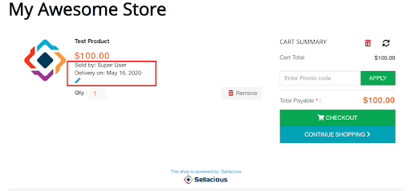

### Product Scope:

In product scope, the seller has the option to divide store delivery time into slots.  These slots then used to deliver products accordingly. Product scope consists of four kinds of Delivery Time Selection.
A. None
B. Day
C. Day & Time Slots
D. Date & Time (Without Slots) 

**NONE:** No delivery slot will be used during placing orders. Buyer can palce order as usual.

**DAY:** This option sets the whole day delivery time as one slot. Sellers can choose **Limit per slot** and **Available till today** which means the time till when the buyer can place an order in case the same day is being selected for delivery.

Now when a buyer adds a product in the cart there is an option to select a delivery date. 

Selected slots will be showing and can be edited in cart and summary steps.

Slots will reflect on the order details page, order email, and invoices.

**DATE & TIME SLOTS:** This option provides an option for the seller to divide the delivery time into slots. Slot duration, Slot padding(time between two delivery slots), and Preparation time can be set from the seller profile.

Now when a buyer adds a product in the cart there is an option to select delivery date and also slot which will be reflected in cart, summery, order details, and order email/invoice.

**DATE & TIME (WITHOUT SLOT):** This option provides an option to the seller to choose **Day and Point of time** for the delivery. In this case, sellers can set **Available till today** and **Preparation time**.

Now when a buyer adds a product in the cart there is an option to pick a day and time.

Which will be reflected in cart, summery, order details, and order email/invoice.

Orders done by any of the above methods will show in the backend delivery orders view and can be processed further from there. 

Shipping Scope: 

In shipping scope, a seller has the option to define shipping rules for the delivery slots. 

After choosing shipping scope sellers can set Slot duration, Slot padding(time between two delivery slots), and Preparation time from the seller profile.

Creating shipping rules for slots is the most important step in this case. Delivery shipping rules can be created when you choose the shipping scope.

In delivery shipping, rates can be defined for Next hours, Days, and for the same day. When it comes to rates for slots, Flat rate can be defined for all-day slots also individually for weekdays slots.

NOTE: Delivery type shipping rules can only be created for sellers(not site-wide) and only one rule per seller. This only can be used when Shipped by Seller and Shipping selection is Sellerwise or Product wise.

Once the delivery shipping is enabled, the buyer will get the option to select shipping for the shop in the shipping step.

Selected slot and shipping will reflect in summary and can be edited from here.
