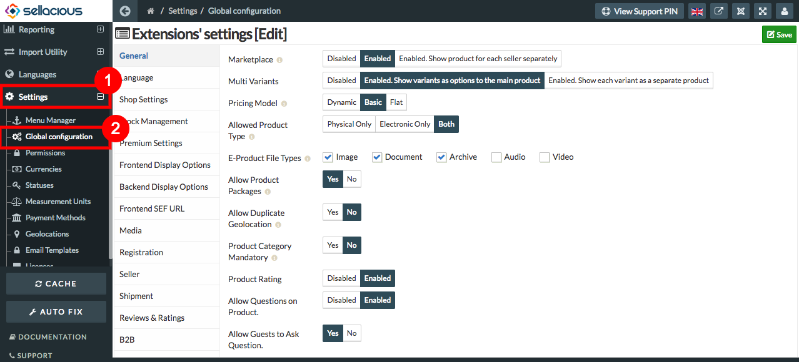
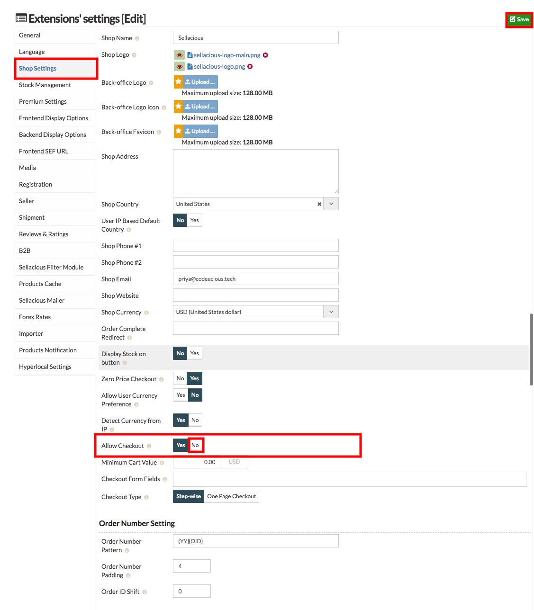

##### **To Disable Checkout, Follow steps:**

1. Go to the Sellacious admin panel.
2. Go to Settings, select global configuration from the dropped down menu.

3. Go to shop settings.
4. In the shop setting section, set Allow Checkout as "NO".
5. Click on save button to save the changes made.

6. Checkout option is disabled.
7. By disabling, Users will not be able to checkout the orders.