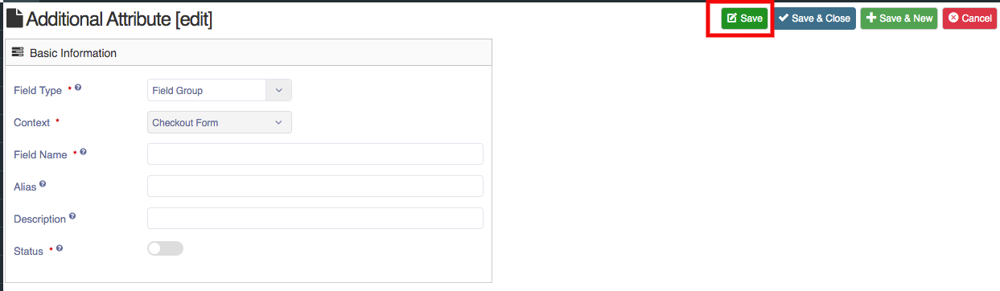
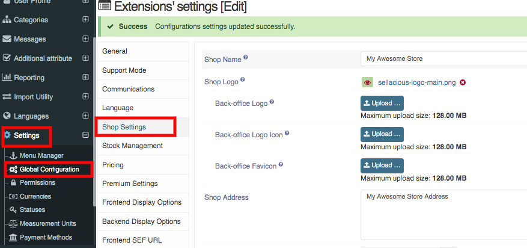
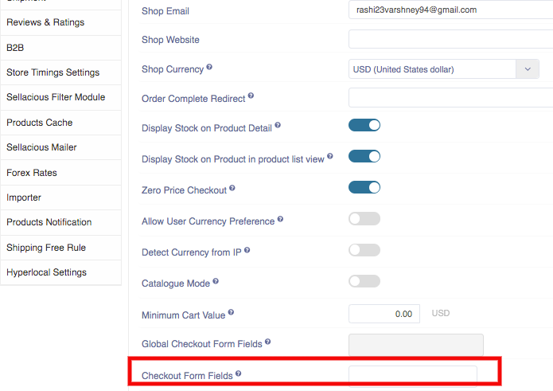

##### **To create Checkout Form Fields, follow Steps:**

1. Go to sellacious admin panel of your website.
2. Go to Additional Attributes, Select Checkout form Fields from the drop down menu.
3. Click on new button to create new Checkout form.

4. Fill the credentials.
5. In Additional attribute section- Field type, Context, Field Name, status Fields are mandatory.
6. Click on save button.

7. And new Checkout Form field is created.

##### **To Add Checkout Form Field, Follow Steps:**

1. Go to the sellacious admin panel.
2. Go to Settings->> Global Configuration from the drop down menu.
3. Select shop setting tab. 
4. In shop setting section mention the name of the Form you want to add in **Checkout Form Fields**. 
5. Add yout checkout fields here and save the settings.
6. And Checkout form is added.

