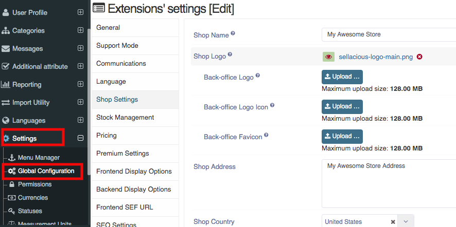
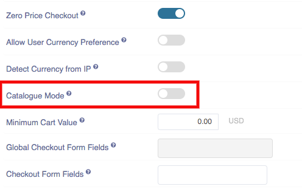

##### **To Disable Checkout, Follow steps:**

1. Go to the Sellacious admin panel of your website.
2. Go to Settings->>Global configuration from the drop-down menu.

3. Go to shop settings.
4. In the shop setting section, enable Catalogue Mode. 
5. Click on save button to save the changes made.

6. Catalogue Mode or disabling checkout: Selecting this option will disable frontend checkout of any kind, and shop will be in catalague mode. where users can only view products, filter, sort, check prices etc but they will not be able to add products in cart nor able to buy now. 