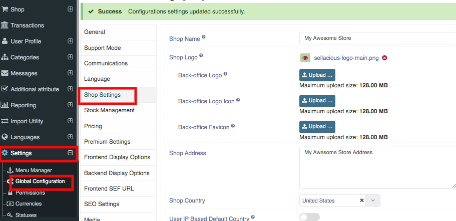
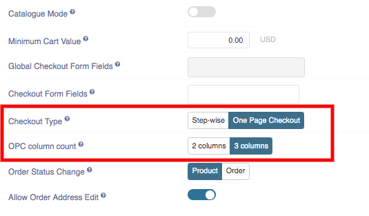
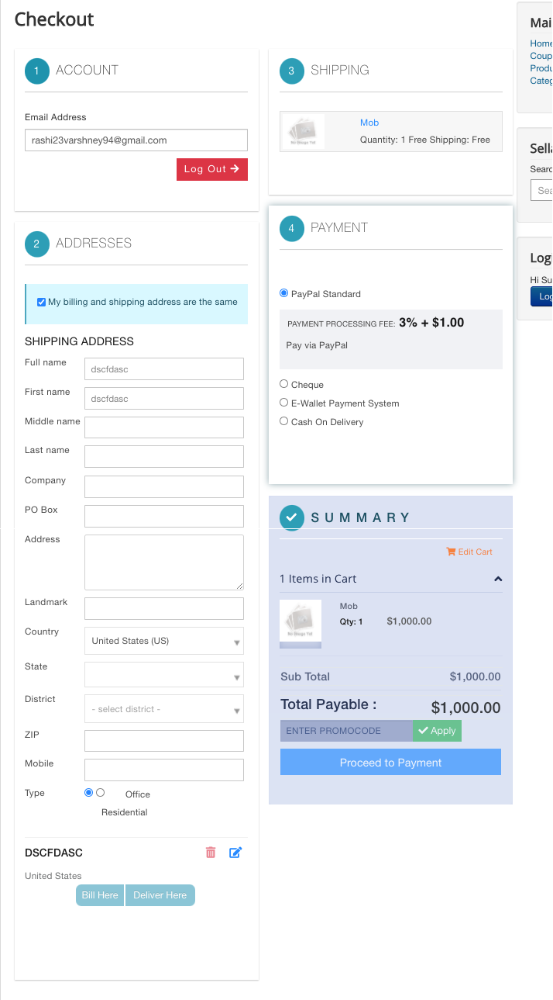
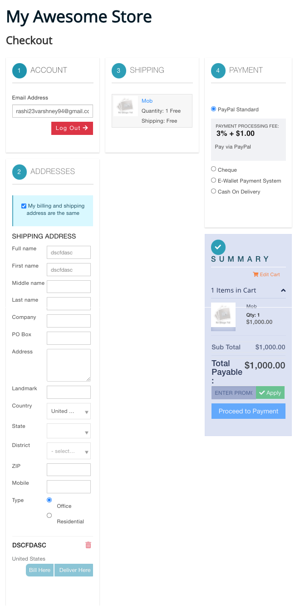

**Written By**: Rashi Gupta
**Date**: 5-06-2020
**Compatibility**: Sellacious v2.0.0-Beta1+

We have two type of checkout: 

1. Step-wise checkout
2. One page Checkout

We will discuss here about one page checkout. In OPC, there is all information showing in one page related to checkout. To make the checkout one page checkout, follow these steps:

1. Go to Sellacious panel of your website.
2. Go to Settings->>Global Configuration->>Shope setting. 
3. In Shop setting, go to the checkout type section select **One Page checkout** 
4. Under this configuration, there is one more setting for OPC column count	: 2 column, 3 column
In 2 column,

In 3 column,

