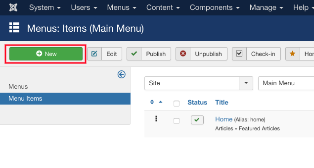
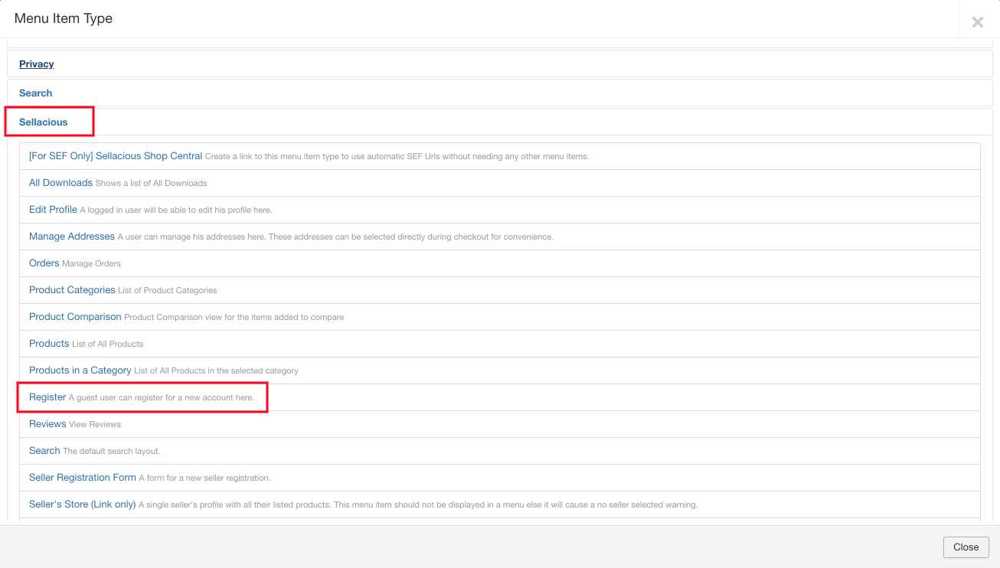
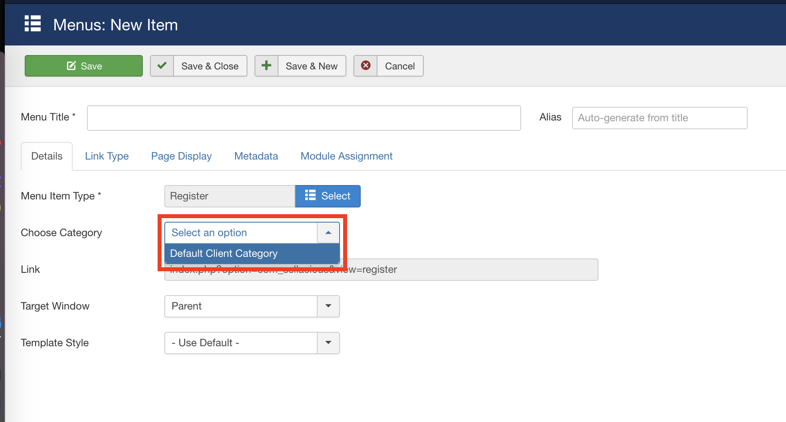
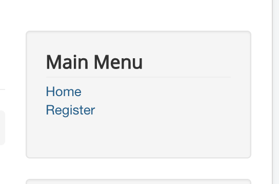
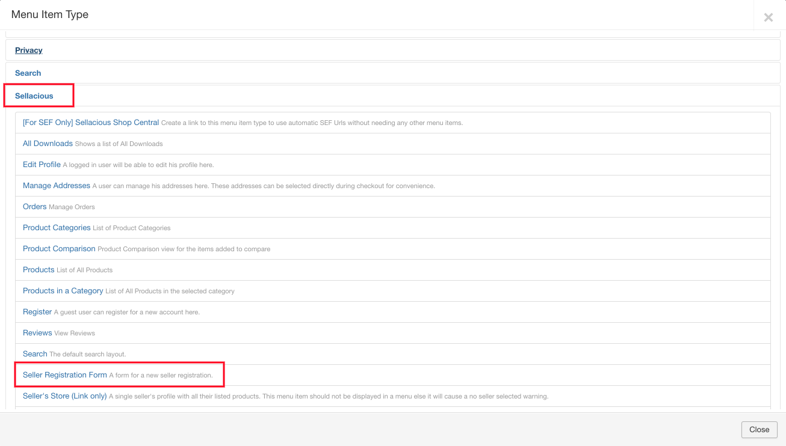
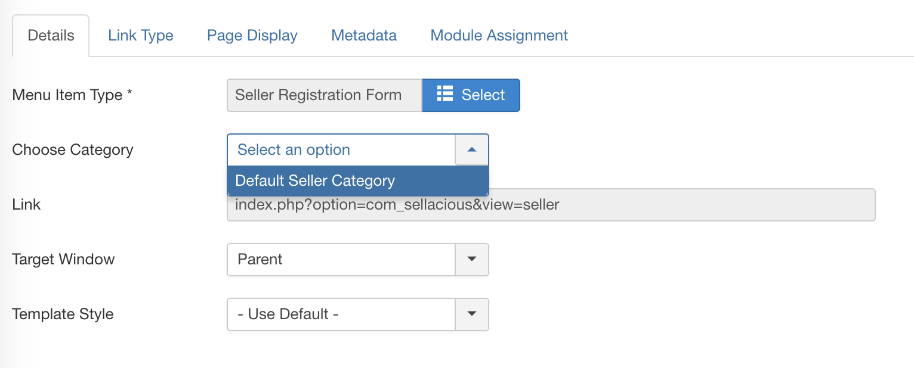

The most important part of a site is to allow users to register on your site. In sellacious you can easily do that.

**Client Registration Form**

To create this form, first go to Joomla administrator. You can access your Joomla administrator from https://yoursite.com/administrator/. After this go to Menus and create a new menu.

Now click on _Select_ of menu type.

After this select Sellacious > Register.

Select the category in which you want Users to be registered.

Select the Menu, in which you want to publish this menu item. It can be main menu (Joomla Default Menu), footer menu, top menu, etc. These menus depends on their module positions. https://docs.joomla.org/Help39:Menus_Menu_Manager and https://docs.joomla.org/Help39:Menus_Menu_Item_Manager will help you more to know about Joomla menus.

Save the menu item, and you'll see the menu in frontend.

Same process is with the Seller Registration except while selecting menu type you'll need to select "Seller Registration Form" and after that seller category in which you want seller's to register.

